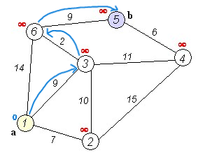
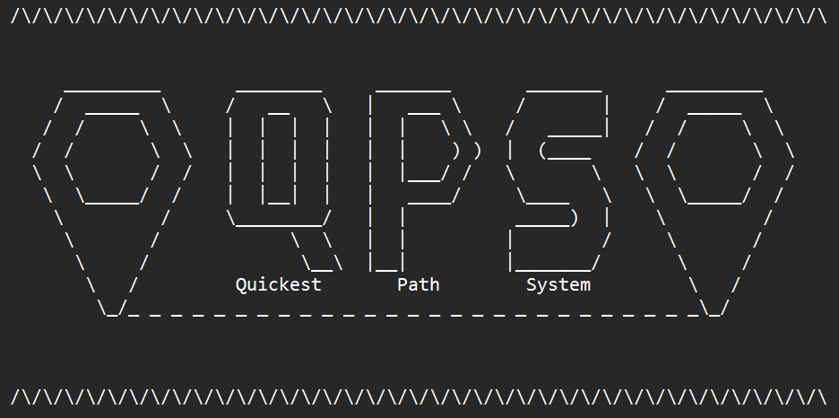

<div align="center">

# Functional Specifications

---

**Project** : Quickest Path <br>
**Team** : 2 <br>
**Created by** : Enoal ADAM <br>
**Creation Date** : 01/06/2024 <br>
**Updated** : 01/20/2024 <br>

---

</div>

<details>
<summary>Table of Contents</summary>

- [Functional Specifications](#functional-specifications)
  - [1.Introduction](#1introduction)
    - [1.1 Project Overview](#11-project-overview)
    - [1.2 Document Purpose](#12-document-purpose)
    - [1.3 Personas](#13-personas)
    - [1.4 Stakeholders and Representatives](#14-stakeholders-and-representatives)
    - [1.5 Deadlines](#15-deadlines)
  - [2. Application Overview](#2-application-overview)
    - [2.1 What is our software used for?](#21-what-is-our-software-used-for)
    - [2.2 What the application used to work?](#22-what-the-application-used-to-work)
  - [3. Software Aspects](#3-software-aspects)
    - [3.1 Performance](#31-performance)
    - [3.2 User Interface (aka UI)](#32-user-interface-aka-ui)
      - [A. Definition](#a-definition)
      - [B. Verification](#b-verification)
      - [C. Main program](#c-main-program)
    - [3.3 Signature](#33-signature)
  - [4. How to use it?](#4-how-to-use-it)
  - [5. Platforms compatibility](#5-platforms-compatibility)
  - [6. Functional requirements](#6-functional-requirements)
    - [6.1 REST API implementation](#61-rest-api-implementation)
      - [A. Route Description](#a-route-description)
      - [B. Requests Examples](#b-requests-examples)
      - [C. Response examples](#c-response-examples)
    - [6.2 Verification processing](#62-verification-processing)
  - [7. Non-functional requirements](#7-non-functional-requirements)
    - [7.1 Response \& Performance](#71-response--performance)
    - [7.2 Reliability](#72-reliability)
    - [7.3 Testability](#73-testability)
    - [7.4 Flexibility](#74-flexibility)
  - [8. Future improvements](#8-future-improvements)
  - [9. MoSCoW table](#9-moscow-table)
  - [10. Complementary Information](#10-complementary-information)
  - [Glossary](#glossary)

</details>

## 1.Introduction

This document is the functional specifications of the 3rd Project of the year called Quickest Path. You can found bellow the name and the role of each member of the team:

| Name              | Role              | Description                                                                                                                                                                                  | GitHub Link                                                       | LinkedIn Link                                                                       |
| ----------------- | ----------------- | -------------------------------------------------------------------------------------------------------------------------------------------------------------------------------------------- | ----------------------------------------------------------------- | ----------------------------------------------------------------------------------- |
| Mattéo LEFIN      | Project Manager   | Responsible for project management, including timelines, planning, and team coordination. Has a role in the choices of the functional aspects of the project.                                | [Mattéo's GitHub Profile](https://github.com/Mattstar64)          | [Mattéo's GitHub Profile](https://www.linkedin.com/in/matt%C3%A9o-lefin-380272293/) |
| Enoal ADAM        | Program Manager   | Decides of the functional aspects of the project, interfaces and so on. Manages functional specification development and client communication for the project.                               | [Enoal's GitHub Profile](https://github.com/EnoGame29)            | [Enoal's GitHub Profile](https://www.linkedin.com/in/enoal-adam-02552932a/)         |
| Guillaume DESPAUX | Technical Leader  | Guides technical decisions and translates functional requirements into scalable technical solutions. Choices the coding standards, how the language will be use into the project.            | [Guillaume's GitHub Profile](https://github.com/GuillaumeDespaux) | [Guillaume's GitHub Profile](https://www.linkedin.com/in/guillaume-despaux/)        |
| Mathis LEBEL      | Software Engineer | Develops and implements codebase, ensures code quality and is governed by technical aspects to create the software.                                                                          | [Mathis' GitHub Profile](https://github.com/mathislebel)          | [Mathis' GitHub Profile](https://www.linkedin.com/in/mathis-lebel-429114293/)       |
| Michel RIFF       | Quality Assurance | Creates tests to validate the quality of the software; that is to say, searches for any types of problems, finds how to optimize the code and reports these issues to the Software Engineer. | [Michel's GitHub Profile](https://github.com/MichelRiff)          | [Michel's GitHub Profile](https://www.linkedin.com/in/michel-riff-693007293/)       |
| Camille GAYAT     | Technical Writer  | Creates an understandable end-user documentation to facilitate the usage of the software.                                                                                                    | [Camille's GitHub Profile](https://github.com/CamilleGayat)       | [Camille's GitHub Profile](https://www.linkedin.com/in/camille-g-a89114293/)        |

### 1.1 Project Overview

The aim of the project is to create a software that find the quickest path between two landmarks in the United States. To achieve this request, we have to use the C++ language[^1]. We decide to name our software "QPS", aka "Quickest Path System", a played of words among GPS "Global Positioning System" and the name of the project "Quickest Path".

### 1.2 Document Purpose

This document is here to provide all the functional specifications of the project. We will cover topics such as who is able to use the software, how you can use the software (briefly), how it functionally works and the features we decide to skip for now but which can be implemented later. <br>
If you reach for technical aspects of the project, such as how the C++ works, the project conventions, how the algorithm is used specifically, please refer you to the [technical specification](../technical/technical_specification.md).

### 1.3 Personas

<details>
<summary><strong>William the project manager</strong></summary>

| **William**                                                                                           | **Description**                                                                                                                                                                                                                                          | **Behavior**                                                                                                                                                                                                                                                                                                                                                                  | **Needs**                                                               |
| ----------------------------------------------------------------------------------------------------- | -------------------------------------------------------------------------------------------------------------------------------------------------------------------------------------------------------------------------------------------------------- | ----------------------------------------------------------------------------------------------------------------------------------------------------------------------------------------------------------------------------------------------------------------------------------------------------------------------------------------------------------------------------- | ----------------------------------------------------------------------- |
| <center></center> | William is a 42-year-old project manager living in New York, thriving in the bustling metropolitan environment. He prefers traditional methods for managing tasks, including commuting, and occasionally uses a smart commuting app for traffic updates. | William’s day is shaped by careful planning and efficiency. He follows a set routine, prioritizing tasks to meet deadlines. While he typically uses traditional methods for commuting, he checks a commuting app for traffic updates when needed. Outside of work, William relies on reliable methods to navigate local events and errands, making the most of his free time. | - Quick and Accurate Routes <br> - Real-Time Updates <br> - Ease of Use |

</details>

<details>
<summary><strong>Karen, the photographer</strong></summary>

| **Karen**                                                                            | **Description**                                                                                                                                                                                                                                                                                                                                                                                   | **Behavior**                                                                                                                                                                                                                                                                                                                                                                                                                   | **Needs**                                                                             |
| ------------------------------------------------------------------------------------ | ------------------------------------------------------------------------------------------------------------------------------------------------------------------------------------------------------------------------------------------------------------------------------------------------------------------------------------------------------------------------------------------------- | ------------------------------------------------------------------------------------------------------------------------------------------------------------------------------------------------------------------------------------------------------------------------------------------------------------------------------------------------------------------------------------------------------------------------------ | ------------------------------------------------------------------------------------- |
|  | Karen is a 30-year-old freelance photographer passionate about traveling who enjoys exploring the diverse landscapes of the United States. She lives in a caravan and as a casual user of technology, she occasionally relies on a navigation app to find quicker routes and make the most of her time in new destinations. Outside of traveling, she enjoys immersing herself in local cultures. | Karen’s daily life is centered around flexibility and spontaneity. She enjoys planning her travels but prefers to go with the flow rather than sticking to a strict schedule. As a casual user of technology, she uses a navigation app for quicker routes when exploring new places. Outside of travel, Karen enjoys immersing herself in local cultures and events, making plans on the spot and navigating with simplicity. | - Real-Time Information <br> - Quick and Flexible Routes <br> - Offline functionality |

</details>

<details>
<summary><strong>Walter, the student</strong></summary>

| **Walter**                                                                           | **Description**                                                                                                                                                                                                                                                                                                                                                                                                      | **Behavior**                                                                                                                                                                                                                                                                                                                                    | **Needs**                                                                            |
| ------------------------------------------------------------------------------------ | -------------------------------------------------------------------------------------------------------------------------------------------------------------------------------------------------------------------------------------------------------------------------------------------------------------------------------------------------------------------------------------------------------------------- | ----------------------------------------------------------------------------------------------------------------------------------------------------------------------------------------------------------------------------------------------------------------------------------------------------------------------------------------------- | ------------------------------------------------------------------------------------ |
|  | Walter is a 21-year-old student in geography living in a small town, he is passionate about maps who enjoys exploring the intricacies of cartography. He actively uses a specialized mapping app to enhance his knowledge and connect with a vibrant user community. Walter shares insights, participates in discussions, and constantly engages with the technology to deepen his connection to his favorite hobby. | Walter’s daily life is driven by his passion for maps. He regularly uses a mapping app to explore new features, contribute to discussions, and learn from the mapping community. Outside of this hobby, he enjoys applying his geographic knowledge in everyday situations, using technology to improve his understanding of places and routes. | - Customizable options <br> - Advanced mapping features <br> - Community integration |

</details>

### 1.4 Stakeholders and Representatives

| Representative           | Role   | Expectation                                                  |
| ------------------------ | ------ | ------------------------------------------------------------ |
| Franck JEANNIN (ALGOSUP) | Client | Project timelines respected and a usable software at the end |

### 1.5 Deadlines

| Name                      | Type     | Deadline                                                                     |
| ------------------------- | -------- | ---------------------------------------------------------------------------- |
| Functional Specifications | Document | February 7th 2025                                                            |
| Technical Specifications  | Document | February 7th 2025                                                            |
| Test Plan                 | Document | February 7th 2025                                                            |
| User Manual               | Document | February 7th 2025                                                            |
| Software(s)               | Product  | February 7th 2025                                                            |
| Weekly Reports            | Document | Every Friday evening (January 10th, 17th, 24th, 31th and February 7th, 14th) |

## 2. Application Overview

In this section, we will talk about the software (in broad outline). To do this, some technical terms are going to be employed to ensure the consistency of the explanations. If you don't know the words used, you can take a glance at the Glossary at the end (by the little chips next to them).

### 2.1 What is our software used for?

The software is a GPS like, a software that uses some algorithms[^2] to define for you the quickest path between two points, landmarks to be precise. When you start it, after some verifications on our side, it will be ask you to enter your current place and where you want to go. The answer will be sent in a specific format (JSON[^3] or XML[^4]) and you will be able to know the optimized path. <br>
To know the error rate or any percentage directly link to a performance section, please look at the [performance](#31-performance) section.

### 2.2 What the application used to work?

To operate, the software is based on algorithms, a finite sequence of specific instructions, the Dijkstra[^5] one. Here is a graph to explain how the algorithm works:


<br>

<div style="align-items: center">
The final result looks like this --> 
</div>

<br>

Since this algorithm is needed to be implement by each person when he created his code to use it, we decided to code ours using the C++ language[^1].

## 3. Software Aspects

This section will treat about the software performances, its interface and how we have turn the technical aspects into a user friendly interface into the command prompt[^6], an important aspect to avoid the user to be lost.

### 3.1 Performance

The software has to respects criteria to be competitive and follows ours objectives. Once you've initialized the verification process (including the file with landmarks), the command prompt must finish the checking, following the number of lines there are in your file (1 minute for 30,000,000 lines), so depending on the file size. <br>
Before you're writing your route, a pre-processing method has to be made to ensure the rapidity of the program when you want to search for the quickest path. <br>
When you enter your depart point and your destination, the API[^7] must respond within 1 second. <br>
Finally, the software has to indicate the most optimized path/the quickest path, without exceeding a margin of error of 10%. This isn't verifiable on your side, which is why we strive to offer you the best service possible!

### 3.2 User Interface (aka UI)

#### A. Definition
Here, we will more speak as an interface than an UI[^12] strictly speaking because the latter is a nice to have, a future improvement (please take a gaze to the [future improvements](#8-future-improvements) to know all enhancements we have planned to add so far).

#### B. Verification
While you're waiting for the verification precess, a percentage bar will be displayed to don't leave you in the dark. After 10 seconds, if the bar didn't progress of any percent, please restart the verification.

#### C. Main program
All the operations will happen on the command prompt (the major interface of the software). Once the pre-processing is done and your starting point defined as well as your arrival point on the command prompt, an answer in the form of the JSON[^4] format (by default) will be displayed.

### 3.3 Signature

To ensure you have correctly downloaded our software, we added a signature/logo into the interface on the command prompt as you can see just below



We also add a signature into the code (check the [technical specification](../technical/technical_specification.md) for further information) much more difficult to spot and remove.

If this logo and our signature aren't here, you've probably downloaded a counterfeit software!

## 4. How to use it?

To use the software, you firstly need to verify the CSV[^8] file you want to use in order to check if it isn't corrupt.
After this verification and if your file is safe to use, you can start the data pre-treatment process to minimize the research of the quickest way between your 2 points.
Once is done, you can write the command to receive the JSON type data (by default) for the most optimized route you want to know.

For further information and/or more precise steps, please refer to the [User Manual](../user_Manual/user_manual.pdf).

## 5. Platforms compatibility

Below are the platforms on which the software has been used and is guaranteed to run:

| Specification                | Windows                                | MacOS             |
| ---------------------------- | -------------------------------------- | ----------------- |
| Operating System[^9] Version | 11 24H2                                | Sequoia 15.2      |
| Processor                    | Intel Core I7 10th Gen (1.30 Ghz Base) | Apple M3 10 Cores |
| RAM                          | 16 GB                                  | 16 GB             |
| Storage                      | SSD 512 GB                             | SSD 512 GB        |
| Resolution                   | 1920x1080px                            | 2560x1664px       |

All information contained in this document is based on observations made from these devices.

As you can see, no mobile platforms is indicate. Indeed, they are a future improvement because for now, the software is not compatible with them. If you want more information, you can check the [future improvements](#8-future-improvements) section.

## 6. Functional requirements

In this section, we will discuss all the functional requirements of the project. For this, we will become a little more technical than before (without being too much either). Fell free to go to the [Glossary](#glossary) section to know all the definitions of technical words.

### 6.1 REST API implementation

#### A. Route Description

- **URL**: ``http://127.0.0.1:8080/quickest_path_system`` ; ``http://localhost:8080/quickest_path_system``
- **Method** : GET
- **Headers**: ``application/json`` or ``application/xml`` are supported
- **Parameters**:

| Name       | Type    | Value                            |
| ---------- | ------- | -------------------------------- |
| format     | string  | json or xml (as indicated above) |
| landmark_1 | integer | Number between 1 and 23947347    |
| landmark_2 | integer | Number between 1 and 23947347    |

#### B. Requests Examples

Here are examples of the requests[^10] you can write to obtain a valid response.

```
GET /quickest_path_system?format=json&landmark_1=270595&landmark_2=30580 HTTP/1.1
```
>[!NOTE]
> - Host: 127.0.0.1:8080 (localhost) <br>
> - Accept: application/json
```
GET /quickest_path_system?format=xml&landmark_1=20006&landmark_2=209007 HTTP/1.1
```
>[!NOTE]
> - Host: 127.0.0.1:8080 (localhost) <br>
> - Accept: application/xml

#### C. Response examples

Here are examples of the response format the API[^7] can send you (related to the examples above).

**JSON format**:
```json
{
  "time": 108,
  "steps": [
    { "landmark": 270595, "distance": 54 },
    { "landmark": 30580, "distance": 54 }
  ]
}
```

**XML format**:
```xml
<response>
  <time>276</time>
  <steps>
    <step>
      <landmark>20006</landmark>
      <distance>138</distance>
    </step>
    <step>
      <landmark>209007</landmark>
      <distance>138</distance>
    </step>
  </steps>
</response>
```

### 6.2 Verification processing

The verification process make sure that the CSV[^8] file you provide and want to use is not corrupted and usable. It verifies the info by the following features:

- Check if the CSV[^8] is available and not empty;
- Verify if the time between to points is not equal to 0 or is negative;
- Look if the Graph is disconnected somewhere (all the landmarks should have at least one connection with another landmark);
- Check if the Landmark 1 and 2 are not the same.

If your file is invalid and can't be used with our software, the error will be shown in detail with the error type and the problematic line.
However, if your file is usable and don't comport any errors or issues, the process will complete and indicate that there are no errors.

## 7. Non-functional requirements

This section regroup all the non-functional requirements of the project, including the response (performance) and reliability, the testability and the flexibility of QPS.

### 7.1 Response & Performance

- The API[^7] have to respond in 1 second on a normal laptop.
- The response must be in a JSON or XML format depending of the user's choice.
- The given route need to be the fastest within a 10% margin of error.
- The verification tool have to return a graph and check if the connectivity of each point is correct.

### 7.2 Reliability

- The verification process indicates if there are any errors so as not to mislead the customer.
- The format chosen by the user have to be correct, that's to say, the program should return a viable format exempt of errors.
- All the sent error (by the REST API[^11]) specify what is the problem (type and problematic line).


### 7.3 Testability

A [test plan](../quality_Assurance/test_plan.md) is written by the Quality Assurance (abbreviate QA after), listing how the code is verified and what is his method allowing anyone who have the competences to also check the code without changing the verification method. The checking process includes all tests which are closely or loosely related to the software.

Therefore, this section refers to how the program's functionalities can be easily test and the ability to resume the test phase if the QA had to leave.

### 7.4 Flexibility

This section indicates how much the code can be improved by future enhancements allowing any developer to add his print to the project if he feels like it. It also refers to the ability to the code to evolve following the needs and fixing any problems that is reported by both the user or the QA.

When the software engineer writes the code, he must ensure the following points:

- The possibility to improve the software through extensions and future improvements *(the next section lists them)*.
- The fact that it is possible there are some bugs that should be fixed.

## 8. Future improvements

All the functionalities which are mentioned above this section in this document will be implemented in the software (unless otherwise stated). However, having a limited time of 6 weeks, we need to choose the functionalities we want to add in the software. <br>
Here is an exhaustive list of the features that can be implemented later:

- Real graphics,
- An application (requiring an UI[^12] *User Interface*),
- A mobile version of the software,
- A history feature which is accessible for the User (like a Ctrl+H on a browser)
- The **Could** Section of the MoSCoW table
  - Downloadable method,
  - CSV[^8] file choice,
  - User friendly requests,
  - Local tab,
  - Margin error displayed.

This list might contain features that will be implemented after the deadlines or will never be integrated.

## 9. MoSCoW table

<table>
  <thead>
    <tr>
      <th>Must Have</th>
      <th>Should Have</th>
    </tr>
  </thead>
  <tbody>
    <tr>
      <td>
        - A functional Dijkstra[^5] algorithm written in C++. <br>
        - Verification process of the CSV[^8] File. <br>
        - A verification process. <br>
        - A pre-treatment process. <br>
        - A REST API[^11] able to accept requests and send responses in a JSON[^3]/XML[^4] format. <br>
        - The time between 2 landmarks without exceeding a margin of error of 10%.
      </td>
      <td>
        - A loading bar that displayed the progress of the verification process. <br>
        - If there is any error, report it to the user. <br>
        - A readable response of the REST API[^11] (not in only one line). <br>
        - A logo and a signature to validate to the user that he has correctly downloaded OUR software. <br>
        - A history feature (not for the user but for the API[^7]), to avoid searching for the same route twice (and reduce the time of the search).
      </td>
    </tr>
  </tbody>
  <thead>
    <tr>
      <th>Could Have</th>
      <th>Won't Have</th>
    </tr>
  </thead>
  <tbody>
    <tr>
      <td>
        - A downloadable method of the JSON[^3]/XML[^4] format response. <br>
        - Before starting the pre-treatment process, a choice of the CSV[^8] file the user want to utilize. <br> 
        - User friendly requests to write on the command prompt. <br>
        -  A local tab (kind of internet page) displaying the response. <br>
        - Indicate the margin of error of the process (if it exists). <br>
        - A history feature for the user.
      </td> 
      <td>
        - An application with graphical UI[^12] and so on. <br>
        - The obligation to execute the verification file each time the user want to search for the quickest path between 2 landmarks. <br>
        - A mobile version.
      </td>
    </tr>
  </tbody>
</table>

## 10. Complementary Information

If you want further information about the project (technical, test plan) or don't know how the software works, you can read these documents:

- [Technical specification](../technical/technical_specification.md): If you are looking for technical information such as how the code is implemented.
- [Test plan](../quality_Assurance/test_plan.md): For those who want to know how the software will be tested.
- [User Manual](../user_Manual/user_manual.pdf): If you want a step by step document to understand the way that the software works.
- [Management Documentation](https://github.com/algosup/2024-2025-project-3-quickest-path-team-2/tree/management/Documents/management): All the documents related to the management like the *Weekly Reports*, *The Code of Conduct* or *the Gantt Charts*


## Glossary

[^1]: C++:
A mid-level (mix of high and low level language) and general-purpose programming language. It allow to create a lot of software and OS like Windows or Linux.

[^2]:Algorithms:
A series of well-defined instructions or rules that you follow to solve a problem or perform a specific task. Here it needs to find the fastest path between 2 landmarks

[^3]:JSON:
(aka *JavaScript Object Notation*) A lightweight data-interchange format that is easy for humans to read and write, and easy for machines to parse and generate. It is a text format that is completely language-independent.

[^4]:XML:
(aka *eXtensible Markup Language*) A versatile and widely-used markup language designed to store and transport data. XML is primarily concerned with carrying data, making it both machine-readable and human-readable.

[^5]: Dijkstra:
An algorithm for finding the shortest paths between nodes in a weighted graph, which may represent, a road network.

[^6]: Command Prompt:
A command-line interpreter application used to execute entered commands, which can automate tasks via scripts files, perform advanced administrative functions, and troubleshoot or solve certain kinds of computer issues.

[^7]:API:
(aka *Application Programming Interface*) A set of rules and protocols that allows different software applications to communicate with each other.

[^8]:CSV:
(aka *Comma Separated Values*) A plain text file that stores data in a tabular format, where each line represents a row and each value is separated by a comma. This format is widely used for data exchange between different applications.

[^9]:Operating System:
(aka *OS*) Manages computer hardware, software resources and provides various services for computer programs. It’s the link between the user and the computer.

[^10]:Requests:
Like a question asked to get something. If the question is phrased correctly, you will get an answer (error or valid).

[^11]:REST API:
(aka *Representational State Transfer API*) A type of Application Programming Interface that adheres to the principles of the REST architectural style. REST APIs provide a flexible, lightweight way to integrate applications and connect components in microservices architectures.

[^12]:UI
The space where interactions between humans and machines occur. It encompasses the visual and interactive elements that users engage with on websites, mobile apps, and other digital platforms.
