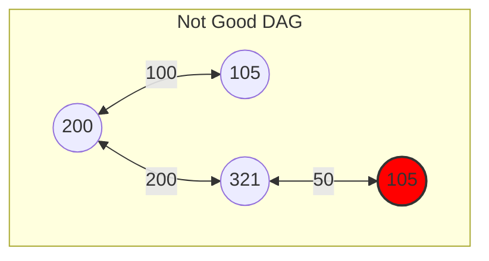
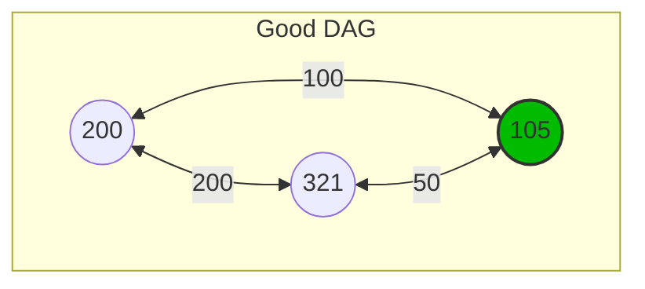
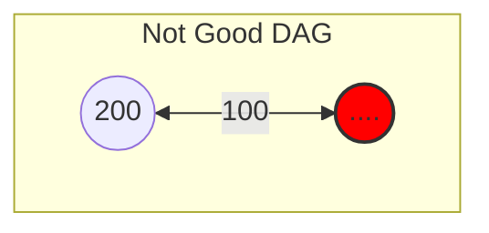
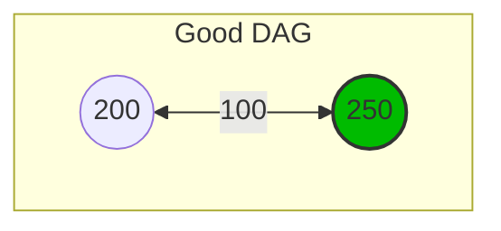
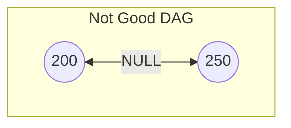
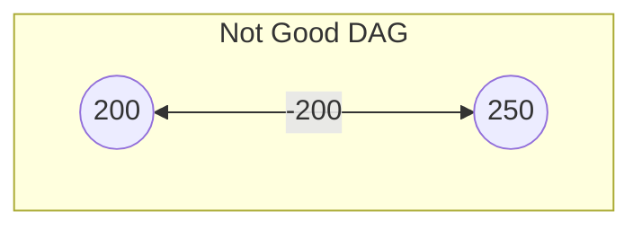
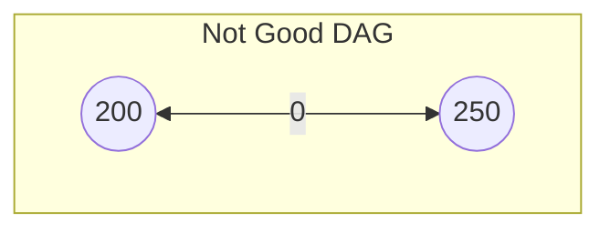
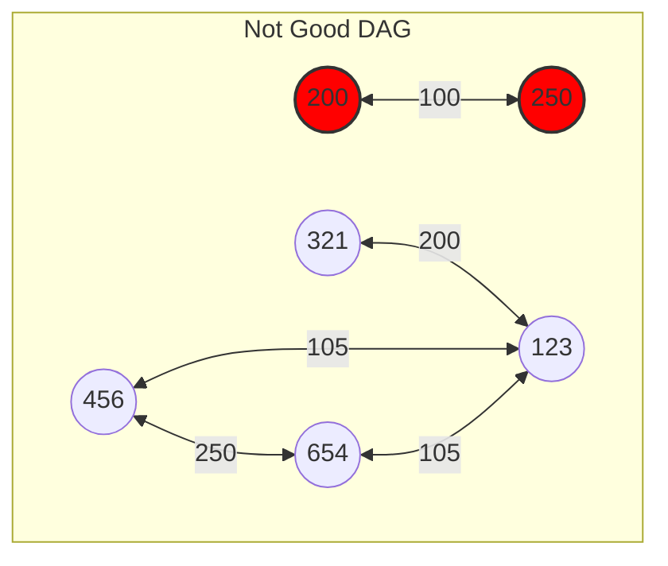
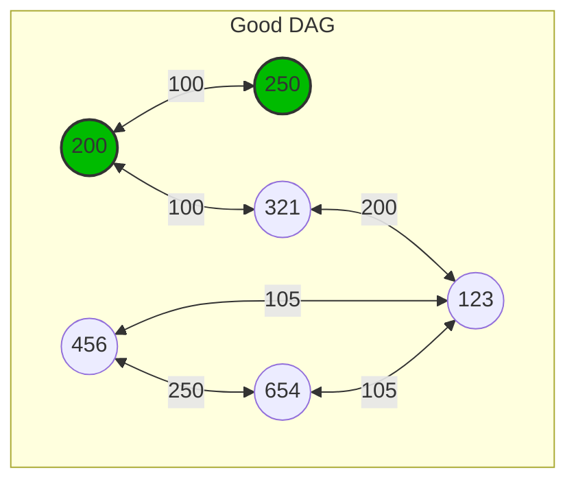

# Technical Specification Document

## Project Overview
<div style="text-align: center">

**Project Name:** Quickest Path  
**Team:** Team 2  
**Document Edited by:** [Guillaume DESPAUX](https://github.com/guillaumedespaux)    
**Last Time Modified:** 01/08/2025

</div>

## Table of Contents
<details>
<summary> <u>Deploy the list</u> </summary>

1. [Introduction](#introduction)
2. [Objectives](#objectives)
3. [Requirements](#requirements)
4. [System Architecture](#system-architecture)
5. [Data Handling](#data-handling)
6. [Algorithm](#algorithm)
7. [User Interface](#user-interface)
8. [Testing](#testing)
9. [Deployment](#deployment)
10. [Maintenance](#maintenance)
</details>

## Introduction
The Quickest Path project aims to develop a software solution that calculates the fastest path between two nodes based on data provided in a CSV[^1] file using C++[^2], the program have to use an REST API[^3] and response in Json[^4] and XML[^5] formats.

## Objectives
- Develop an efficient algorithm to find the quickest path.
- Ensure the software can handle large datasets.
- Analyze the data given to ensure a proper integrity of data.
- Provide a user-friendly interface for input and output.
- Provide answer through an API using the GET[^6] methods.

## Project Folder Structure

```bash
2024-2025-project-3-quickest-path-team-2
├── .gitignore  # ignore the file mentioned inside
├── bin # store all executable programs
├── documents   # folder that store all the main files
│  ├── functional                               
│  ├── images   # reserved for all images contained in files
│  │  ├── functional                             
│  │  ├── management                            
│  │  ├── quality_Assurance                     
│  │  └── technical                             
│  ├── management                               
│  ├── quality_Assurance                        
│  ├── technical                                
│  │  └── technical_specification.md            
│  └── user_Manual                              
├── README.md   # a resume of what the project stand for and how to use it
├── src # folder where all the code will be implemented
│  ├── data # folder where .csv file will be stored
│  │  └── example.csv                           
│  ├── includes # folder where .hpp file will be stored
│  │  └── software.hpp                             
│  ├── software.cpp                             
└── test    # reserved for the test unit part
  └── test.cpp                                  
``` 

## Conventions
There are the conventions to follow during the project.

### Naming Conventions

|   Type    |   Example     |   Convention name |
|:-         |:-             |:-                 |
|Folder     |folder_Name    |camel_Snake_Case   |
|File       |file_name      |snake_case         |
|DEFINE     |DEFINE_WELL    |CONSTANT_CASE      |
|typedef    |TPDF_STRING    |CONSTANT_CASE      |
|const      |BestConstEver  |PascalCase         |
|variable   |bestVarEver    |camelCase          |
|function   |good_function()|snake_case         |
|struct     |s_Struct       |camel_Snake_Case   |
|class      |class_Class    |camel_Snake_Case   |


> [!WARNING]  
> The types **DEFINE** and **typedef** uses the same convention, however typedef have for the first word an abbreviation then we indicate the type used.

>[!CAUTION]
> Each structure have to have in their name the pre-fix "s_".

### Files Conventions
>[!NOTE]
> Each .cpp file have to be joined with it's equivalent named .hpp, for instance if the file software.cpp is created the file software.hpp **HAVE** to be created.

There is an example to use the different files.


```cpp
software.cpp
    #include "software.hpp"
    #define NICE_TEXT "Hello,"

    int main(void) {
        // Using Class
        Student class_Guillaume("Guillaume", 21);
        class_Guillaume.print_some_text(NICE_TEXT);
        class_Guillaume.declare_the_function(42);
        class_Guillaume.~Student();

        // Using Struct
        s_Student *struct_Guillaume = new s_Student;
        struct_Guillaume->name = "Guillaume";
        struct_Guillaume->age = 21;
        declare_the_function(struct_Guillaume->age);
        delete struct_Guillaume;
    }

    Student::Student(string name, unsigned short age) {
        this->name = name;
        this->age = age;
    }

    Student::~Student() {
        cout << "The student " << this->name << " is deleted." << endl;
    }

    int declare_the_function(int bestIntEver) {
        int newBestIntEver = bestIntEver;
        newBestIntEver += bestIntEver;
        return newBestIntEver;
    }

    void print_some_text(string NICE_TEXT) {
        if (NICE_TEXT != "\0") {
            cout << NICE_TEXT << " world!" << endl;
        }
        cout << "NICE_TEXT is empty." << endl;
    }
```
>[!IMPORTANT]
>The .cpp file is only used to implement the logical interaction in.
> 
```cpp
software.hpp
    #pragma once
    #include <iostream>
    #include <string>
    
    using namespace std;

    typedef struct Student{
        string name;
        unsigned short age;
    } s_Student;

    class Student {
        private:
            string name;
            unsigned short age;
        public:
            int declare_the_function(int bestIntEver);
            void print_some_text(string niceText);
            Student(string name, unsigned short age);
            ~Student();
    };

    /*
        This function double the value of itself.
        params:
            int bestIntEver
        return: 
            int newBestIntEver
    */
    int declare_the_function(int bestIntEver);
    
    /*
        Permit the print the text given as parameter.
        params:
            string niceText;
    */
    void print_some_text(string niceText);
```
>[!CAUTION]
>The .hpp file permit only to declare functions and comment the utility of each ones, explaining also the parameters and what it return.

> [!NOTE]
> ```cpp
> #pragma once
> ```
> Is a preprocessor directive used to prevent header files from being included multiple times.

## Requirements
Before continuing reading, it is highest recommended to read the [functional specification](../functional/) document.

## System Architecture
### Overview
- **Input:** CSV file containing node connections and times.
- **Processing:** Algorithm to calculate the quickest path.
- **Output:** Display of the quickest path and time.

### Components
1. **Data Importer:** Reads and parses the CSV file.
2. **Path Calculator:** Implements the algorithm to find the quickest path.
3. **User Interface:** Allows users to input nodes and view results.

### Technologies
We will use the following technologies:
1. C++
   - C++17
   - Standard libraries
2. REST API
    - Libraries #TODO
    - GET method
3. CSV
   - .csv file format
4. JSON
   - .json file format
5. XML
   - .xml file format

## Data Handling
### CSV File Format
- **Columns:** landmark_1, landmark_2, Time
- **Example:**
    ```
    landmark_1,landmark_2,Time
    1,2,1000
    2,3,1500
    ```

### Data Validation
When CSV provided we have to make different checks to ensure the data are correct and usable and follows the connectivity check rules. We also have to check if the data provided is a Directed Acyclic Graph (DAG) to ensure the algorithm will work properly.

##### Loops
```csv
loop =  landmark_1, landmark_2, time
        105, 501, 200 -> First time declared
        321, 123, 200
        501, 105, 250 -> Second time declared
```
<div style="text-align: center">



</div>

##### Landmark Missing
```csv
landmark missing =  landmark_1, landmark_2, time
            , 501, 200  -> landmark_1 is missing
            321, , 200  -> landmark_2 is missing
```
<div style="text-align: center">




</div>

##### Time Missing
```csv
time missing = landmark_1, landmark_2, time
            501, 105,   -> time is missing
```
<div style="text-align: center">


</div>

##### Negative Time
```csv
time negative = landmark_1, landmark_2, time
                501, 105, -200 -> time can not be negative
```
<div style="text-align: center">


</div>

##### Time Equal to 0
```csv
time equal 0 = landmark_1, landmark_2, time
                501, 105, 0 -> time can not be equal to 0 
```
<div style="text-align: center">


</div>

##### Graph disconnected
```csv
disconnected =  landmark_1, landmark_2, time
                200 ,250, 100 -> Those two nodes are not connected
                321, 123, 200 
                456, 654, 250
                456, 321, 105
                654, 123, 105
```
<div style="text-align: center">




</div>

### Organization
To check if the data provided is a DAG we have to use the following steps:

1. Check if csv is available.
2. Check if the csv is not empty.
3. Separate the csv in parts that contains the 10% of the data.
4. Create an **Adjacency Matrix** to save connections that exists.
5. Verify if landmark_1 and landmark_2 are not the same.
6. Verify if the time is not negative or equal to 0.
7. Verify if the line's data is already in the Adjacency Matrix.
8. Save each line in the Adjacency Matrix.
9. Start over step 5 until the end of the chunk.
10. Start over step 3 until the end of the csv.

>[!TIP]
> The Adjacency Matrix is a two dimensional array that contains the connections between the nodes, the first dimension is the landmark_1 and the second is the landmark_2.

>[!WARNING]
> The Adjacency Matrix is a vector to save connections that exists and store in response the weight of each path.
>
>```cmd
>Adjacency Matrix Example:
>
>   1  2  3  4  5  6  7  8  9 landmark_1
>1 0  0 89  0 12  0  0  0 34
>2 0  0 67  0  0  0  0  0  0
>3 0  0  0  0 56  0  0  0  0
>4 0  0  0  0  0 78  0  0  0
>5 0  0  0  0  0  0  0 23  0
>6 0  0  0  0  0  0  0  0 45
>7 0  0  0  0  0  0  0  0  0
>8 0  0  0  0  0  0  0  0  0
>9 0 12  0  0  0  0  0 34  0
>landmark_2
>```
vector<vector<int> >;
>[!NOTE]
> The Adjacency Matrix have to filed with [std::unordered_map](https://en.cppreference.com/w/cpp/container/unordered_map) to match the [Big(O)](#^x) Notation of O(1) to access the data:
> ```cpp
> std::unordered_map<int, std::unordered_map<int, int>> *AdjacencyMatrix.
>```

## Shortest Path Algorithm
This part will define the algorithm used to find the quickest path between two nodes and how it should be implemented.

### Description
The algorithm we will use are named **Dijkstra**, it permit the find the shortest path between two nodes taking in account the weight of the edges between the nodes of the graph.

```mermaid

```

### Pseudocode
Provide pseudocode for the algorithm.

## REST API
YES[^1]

## User Interface
### Input
- Text fields for entering the start and end nodes.
- Button to trigger the calculation.

### Output
- Display the quickest path and total time.
- Option to view the path details.

## Testing
### Unit Tests
- Test data import functionality.
- Test path calculation with various datasets.

### Integration Tests
- Ensure all components work together seamlessly.

### Performance Tests
- Measure the time taken to process large datasets.

## Deployment
### Environment
- Specify the required software and hardware.

### Installation
- Provide steps to install and configure the software.

## Maintenance
### Updates
- Outline the process for updating the software.

### Support
- Provide contact information for technical support.

## Indexes
[^1]:
[^2]:
[^3]:
[^4]:
[^5]:
[^6]:
[^7]:
[^8]:
[^9]:
[^10]:
[^11]:
[^12]:
[^13]:
[^14]:
[^15]:
[^16]:
[^17]:
[^18]:
[^19]:
[^20]:
