# Technical Specification Document

## 1. Project Overview

<div align="center">

**Project Name:** Quickest Path  
**Team:** Team 2  
**Document Edited by:** [Guillaume DESPAUX](https://github.com/guillaumedespaux)<br>
**Last Time Modified:** 01/29/2025

</div>

## 2. Table of Contents

<details close>
<summary> <u>Deploy the list</u> </summary>

- [Technical Specification Document](#technical-specification-document)
  - [1. Project Overview](#1-project-overview)
  - [2. Table of Contents](#2-table-of-contents)
  - [3. Introduction](#3-introduction)
  - [4. Objectives](#4-objectives)
  - [5. Project Folder Structure](#5-project-folder-structure)
  - [6. Conventions](#6-conventions)
    - [6.1. Naming Conventions](#61-naming-conventions)
    - [6.2. Files Conventions](#62-files-conventions)
  - [7. Requirements](#7-requirements)
  - [8. System Architecture](#8-system-architecture)
    - [8.1. Overview](#81-overview)
    - [8.2. Components](#82-components)
    - [8.3. Technologies](#83-technologies)
  - [9. Processing Flow](#9-processing-flow)
  - [10. Data Handling](#10-data-handling)
    - [10.1. CSV File Format](#101-csv-file-format)
    - [10.2. Data Validation](#102-data-validation)
      - [10.2.1. Loops](#1021-loops)
      - [10.2.2. Landmark Missing](#1022-landmark-missing)
      - [10.2.3. Time Missing](#1023-time-missing)
      - [10.2.4. Negative Time](#1024-negative-time)
      - [10.2.4. Time Equal to 0](#1024-time-equal-to-0)
      - [10.2.5. Graph disconnected](#1025-graph-disconnected)
    - [10.3 Organization](#103-organization)
      - [10.3.1. Graph Validation](#1031-graph-validation)
      - [10.3.2. Connectivity Check](#1032-connectivity-check)
  - [11. Shortest Path Algorithm](#11-shortest-path-algorithm)
    - [11.1. Dijkstra Algorithm](#111-dijkstra-algorithm)
    - [11.2. Pseudocode](#112-pseudocode)
      - [11.2.1. Node Structure](#1121-node-structure)
      - [11.2.2. Adjacency List / Graph Structure](#1122-adjacency-list--graph-structure)
  - [12. REST API](#12-rest-api)
    - [12.1. Overview](#121-overview)
    - [12.2. Dependencies](#122-dependencies)
    - [12.3. Installation](#123-installation)
      - [12.3.1. Windows](#1231-windows)
      - [12.3.2. macOs](#1232-macos)
      - [12.3.3. Linux](#1233-linux)
    - [12.4. Template](#124-template)
    - [12.5. Accessibility](#125-accessibility)
      - [12.5.1. HTML (prototype)](#1251-html-prototype)
      - [12.5.2. Command Line](#1252-command-line)
      - [12.5.3. Application](#1253-application)
    - [12.6. API Endpoints \& Response](#126-api-endpoints--response)
  - [13. Memory Management](#13-memory-management)
    - [13.1. Preprocessing](#131-preprocessing)
  - [14. Deployment](#14-deployment)
    - [14.1. Environment](#141-environment)
    - [14.2. Steps](#142-steps)
  - [15. Maintenance](#15-maintenance)
    - [15.1. Updates](#151-updates)
  - [16. Glossary](#16-glossary)

</details>

## 3. Introduction

The Quickest Path project aims to develop a software solution that calculates the fastest path between two nodes based on data provided in a CSV[^1] file using C++[^2], the program have to use an REST API[^3] and respond in JSON[^4] and XML[^5] formats.

## 4. Objectives

- Develop an efficient algorithm to find the quickest path.
- Ensure the software can handle large datasets.
- Analyze the data given to ensure a proper integrity of data.
- Provide a user-friendly interface for input and output.
- Provide response through an API[^3] using the GET[^6] methods.

## 5. Project Folder Structure

```bash
2024-2025-project-3-quickest-path-team-2
├── .gitignore  # ignore the file mentioned inside
├── bin # store all executable programs
├── documents   # folder that stores all the main files
│  ├── functional                               
│  ├── images   # reserved for all images contained in files
│  │  ├── functional                             
│  │  ├── management                            
│  │  ├── quality_Assurance                     
│  │  └── technical                             
│  ├── management                               
│  ├── quality_Assurance                        
│  ├── technical                                
│  │  └── technical_specification.md            
│  └── user_Manual                              
├── README.md   # a resume of what the project stand for and how to use it
├── src # folder where all the code will be implemented
│  ├── api # folder where all the api code will be stored
│  ├── build # folder where all the build files will be stored
│  ├── data # folder where .csv file will be stored
│  │  └── example.csv                           
│  ├── includes # folder where .hpp file will be stored
│  │  └── software.hpp                             
│  ├── software.cpp                             
└── test    # reserved for the test unit part
  └── test.cpp                                  
```

## 6. Conventions

There are the conventions to follow during the project.

### 6.1. Naming Conventions

|   Type    |   Example     |   Convention name |
|:-         |:-             |:-                 |
|Folder     |folder_Name    |camel_Snake_Case   |
|File       |file_name      |snake_case         |
|DEFINE     |DEFINE_WELL    |CONSTANT_CASE      |
|typedef    |TPDF_STRING    |CONSTANT_CASE      |
|const      |BestConstEver  |PascalCase         |
|variable   |bestVarEver    |camelCase          |
|function   |good_function()|snake_case         |
|struct     |s_Struct       |camel_Snake_Case   |
|class      |class_Class    |camel_Snake_Case   |

> [!WARNING]  
> The types **DEFINE** and **typedef** uses the same convention, however typedef have for the first word an abbreviation then we indicate the type used.

>[!CAUTION]
> Each structure have to have in their name the pre-fix "s_".

### 6.2. Files Conventions

>[!NOTE]
> Each .cpp file have to be joined with its equivalent named .hpp, for instance if the file software.cpp is created the file software.hpp **HAVE** to be created.

There is an example to use the different files.

```cpp
software.cpp
    #include "software.hpp"
    #define NICE_TEXT "Hello,"

    int main(void) {
        // Using Class
        Student class_Guillaume("Guillaume", 21);
        class_Guillaume.print_some_text(NICE_TEXT);
        class_Guillaume.declare_the_function(42);
        class_Guillaume.~Student();

        // Using Struct
        s_Student *struct_Guillaume = new s_Student;
        struct_Guillaume->name = "Guillaume";
        struct_Guillaume->age = 21;
        declare_the_function(struct_Guillaume->age);
        delete struct_Guillaume;
    }

    Student::Student(string name, unsigned short age) {
        this->name = name;
        this->age = age;
    }

    Student::~Student() {
        cout << "The student " << this->name << " is deleted." << endl;
    }

    int declare_the_function(int bestIntEver) {
        int newBestIntEver = bestIntEver;
        newBestIntEver += bestIntEver;
        return newBestIntEver;
    }

    void print_some_text(string NICE_TEXT) {
        if (NICE_TEXT != "\0") {
            cout << NICE_TEXT << " world!" << endl;
        }
        cout << "NICE_TEXT is empty." << endl;
    }
```

>[!IMPORTANT]
>The .cpp file is only used to implement the logical interaction in.

```cpp
software.hpp
    #pragma once
    #include <iostream>
    #include <string>
    
    using namespace std;

    typedef struct Student{
        string name;
        unsigned short age;
    } s_Student;

    class Student {
        private:
            string name;
            unsigned short age;
        public:
            int declare_the_function(int bestIntEver);
            void print_some_text(string niceText);
            Student(string name, unsigned short age);
            ~Student();
    };

    /*
        This function double the value of itself.
        params:
            int bestIntEver
        return: 
            int newBestIntEver
    */
    int declare_the_function(int bestIntEver);
    
    /*
        Allows printing the text given as parameter.
        params:
            string niceText;
    */
    void print_some_text(string niceText);
```

>[!CAUTION]
>The .hpp file permit only to declare functions and comment the utility of each ones, explaining also the parameters and what it return.

> [!NOTE]
>
> ```cpp
> #pragma once
> ```
>
> Is a preprocessor directive used to prevent header files from being included multiple times.

## 7. Requirements

Before continuing to read, it is highest recommended to read the [functional specification](../functional/functional_specification.md) document.

## 8. System Architecture

### 8.1. Overview

- **Input:** CSV[^1] file containing node connections and times.
- **Processing:** Algorithm to calculate the quickest path.
- **Output:** Display of the quickest path and time.

### 8.2. Components

1. **Data Importer:** Reads and parses the CSV[^1] file.
2. **Path Calculator:** Implements the algorithm to find the quickest path.
3. **User Interface:** Allows users to input nodes and view results.

### 8.3. Technologies

We will use the following technologies:

- C++[^2]
  - C++17[^7]
  - Standard libraries
- REST API
  - Libraries
  - GET method
- CSV[^1]
  - .csv file format
- JSON[^4]
  - .json file format
- XML[^5]
  - .xml file format

## 9. Processing Flow

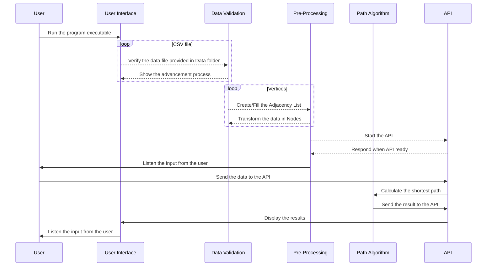

## 10. Data Handling

### 10.1. CSV File Format

- **Columns:** landmark_1, landmark_2, Time
- **Example:**

    ```bash
    landmark_1,landmark_2,Time
    1,2,1000
    2,3,1500
    ```

### 10.2. Data Validation

When CSV[^1] provided we have to make different checks to ensure the data are correct and usable and follows the connectivity check rules. We also have to check if the data provided is a Directed Acyclic Graph (DAG[^8]) to ensure the algorithm will work properly.

#### 10.2.1. Loops

```csv
loop =  landmark_1, landmark_2, time
        105, 501, 200 -> First time declared
        321, 123, 200
        501, 105, 250 -> Second time declared
```

<div align="center">

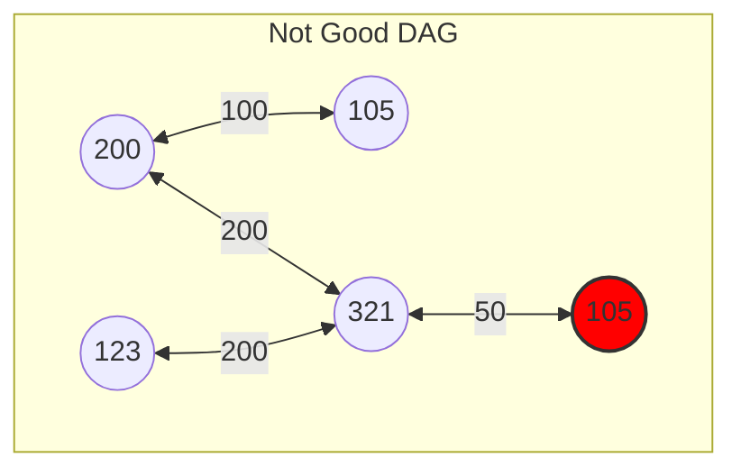

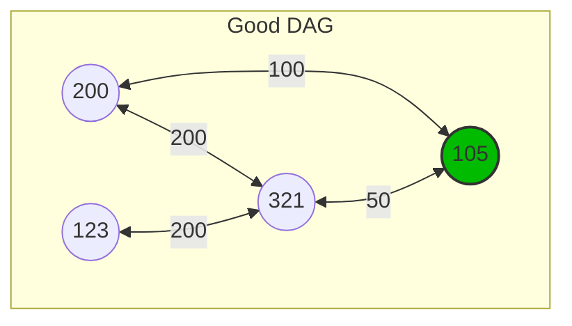

</div>

#### 10.2.2. Landmark Missing

```csv
landmark missing =  landmark_1, landmark_2, time
            , 501, 200  -> landmark_1 is missing
            321, , 200  -> landmark_2 is missing
```

<div align="center">

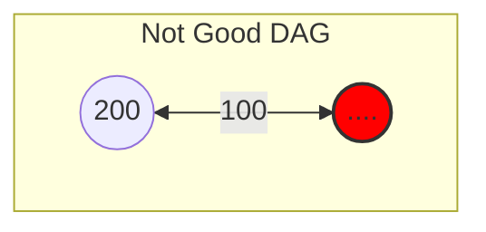

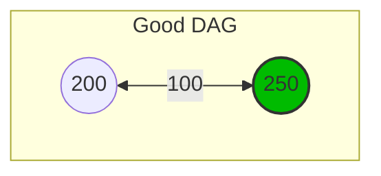

</div>

#### 10.2.3. Time Missing

```csv
time missing = landmark_1, landmark_2, time
            501, 105,   -> time is missing
```

<div align="center">

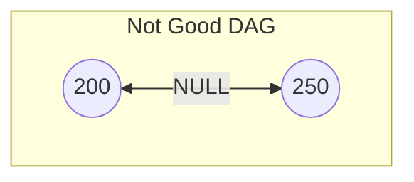

</div>

#### 10.2.4. Negative Time

```csv
time negative = landmark_1, landmark_2, time
                501, 105, -200 -> time can not be negative
```

<div align="center">

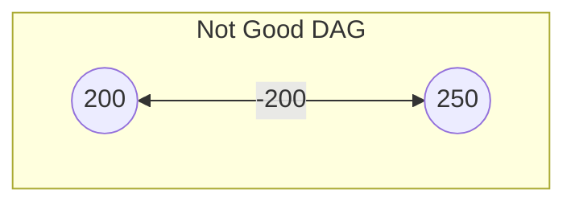

</div>

#### 10.2.4. Time Equal to 0

```csv
time equal 0 = landmark_1, landmark_2, time
                501, 105, 0 -> time can not be equal to 0 
```

<div align="center">

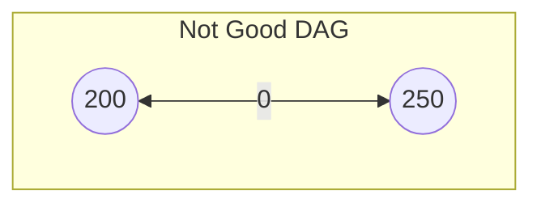

</div>

#### 10.2.5. Graph disconnected

```csv
disconnected =  landmark_1, landmark_2, time
                200 ,250, 100 -> Those two nodes are not connected
                321, 123, 200 
                456, 654, 250
                456, 321, 105
                654, 123, 105
```

<div align="center">

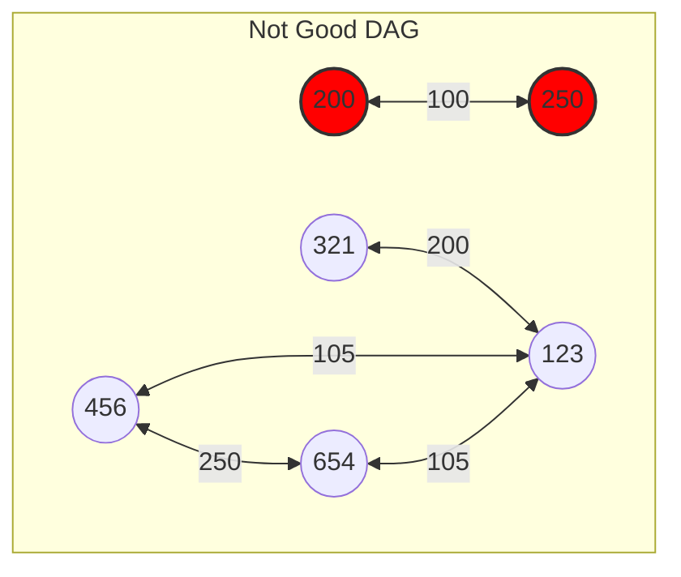

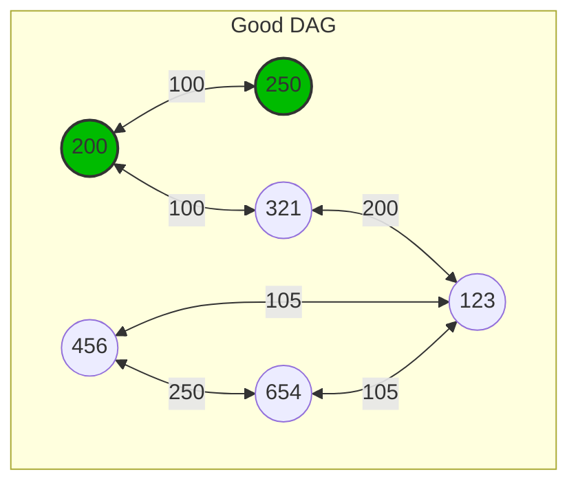

</div>

### 10.3 Organization

To ensure the proper verification of the data, we have to transform the data into a Adjacency List to make the edges directional.

#### 10.3.1. Graph Validation

To check if the data provided by the CSV[^1] is a DAG[^8] we have to use the DFS[^9] (Depth First Search) algorithm to check if the graph is not a cycle.

<div align="center">

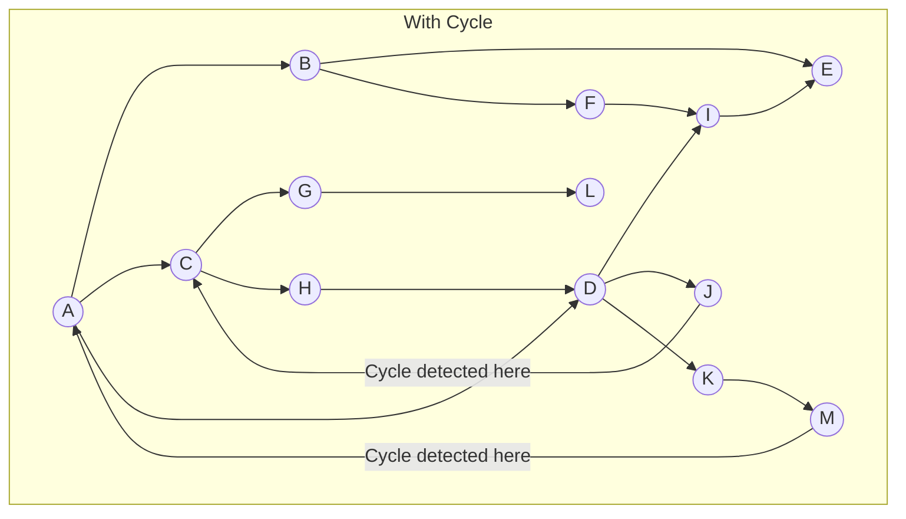

</div>

>[!IMPORTANT]
> If the data given have a cyclic path the algorithm will not work properly. To do so we have to transform each edges into directional edges, even if the data provided is defined as by-directional.

>[!NOTE]
> For this specific part the weight of the edges is not important since we only have to check if the graph is a DAG[^8].

<div align="center">

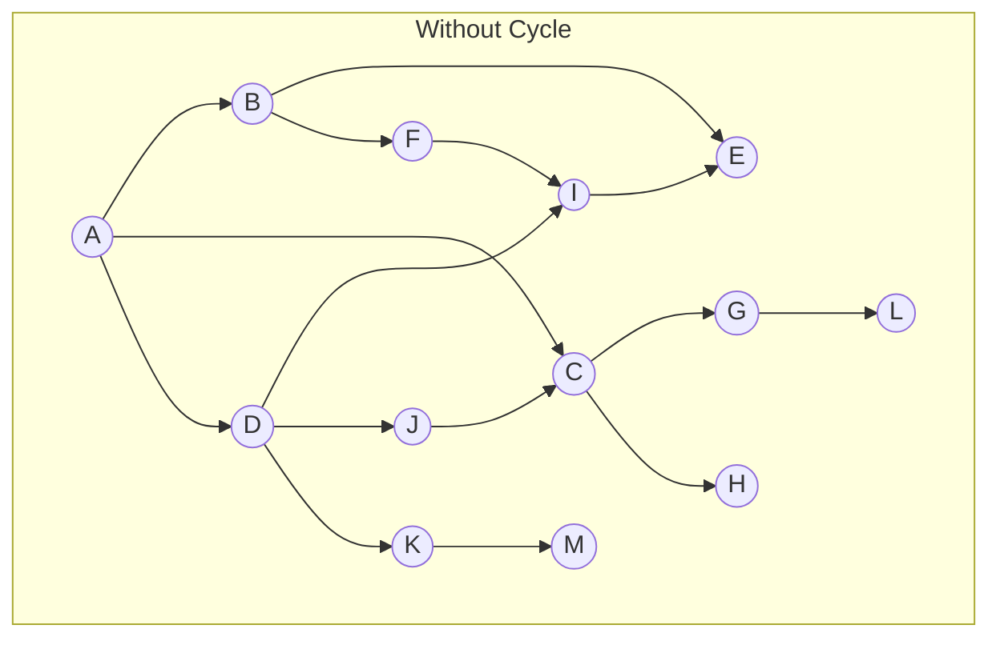

</div>

>[!NOTE]
> By definition, a cycle occurs if a vertex is visited twice within the same path during traversal. Additionally, if a parent node has no unvisited child nodes but revisits a node already in the current path, a cycle is confirmed.

#### 10.3.2. Connectivity Check

To ensure the graph is connected, we need to verify that all nodes are reachable from any starting node. This can be achieved using the BFS[^10] (Breadth First Search) algorithm. The BFS[^10] algorithm will traverse the graph level by level, starting from a given node, and visit all its neighbors before moving to the next level. If all nodes are visited during this traversal, the graph is connected. Otherwise, it is disconnected.

Here is a visual representation of a disconnected graph:

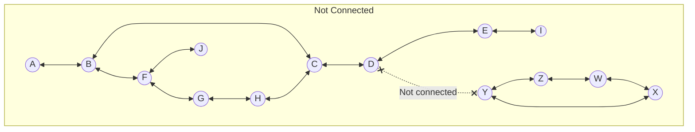

>[!CAUTION]
>In the above graph, nodes A to J form one connected component, while nodes X to W form another. There is no path between these two components, making the graph disconnected.

Here is a visual representation of a connected graph:

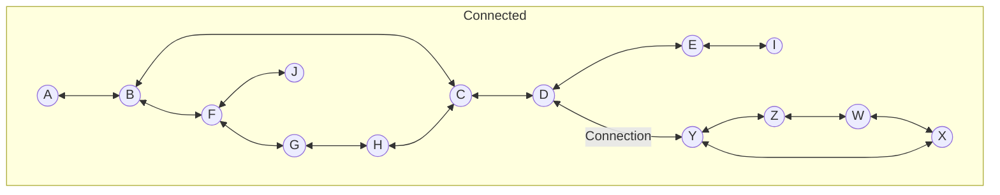

>[!IMPORTANT]
>In this graph, all nodes are connected, either directly or indirectly, forming a single connected component. This ensures that there is a path between any pair of nodes in the graph.

## 11. Shortest Path Algorithm

This part will define the algorithm used to find the quickest path between two nodes and how it should be implemented.

### 11.1. Dijkstra Algorithm

The algorithm we will use is named **Dijkstra**[^11]. It finds the shortest path between two vertices, taking into account the weight of the edges between the vertices of the graph.

>[!NOTE]
>The time complexity of Dijkstra's algorithm depends on the data structure used to implement the priority queue. Here are the complexities for different implementations:
>
>- **Using a binary heap:** O((V + E) log V)
>- **Using a Fibonacci heap:** O(E + V log V)
>
>Where:
>
>- V is the number of vertices.
>- E is the number of edges.
>
>The space complexity is O(V + E) due to the storage of the graph and the priority queue.

The algorithm is based on the following steps:

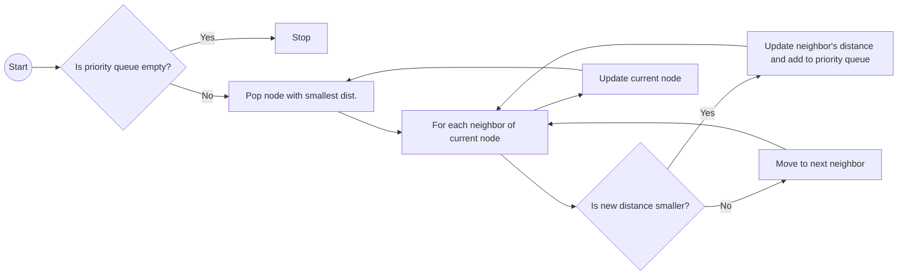

1. Initialize the distance of the source node to 0 and all other vertices to infinity.
2. Set the source node as the current node.
3. For each neighbor of the current node, calculate the distance from the source node.
4. If the calculated distance is less than the current distance, update the distance.
5. Mark the current node as visited and remove it from the set.
6. If the destination node is reached or the set is empty, stop the algorithm.
7. Repeat steps 3-7 until the destination node is reached.

>[!IMPORTANT]
>To enhance the algorithm we will use `std::priority_queue` to store the vertices and their distances from the source node.

<details close>
<summary> <u>Full Schematic Of The Methodology</u> </summary>

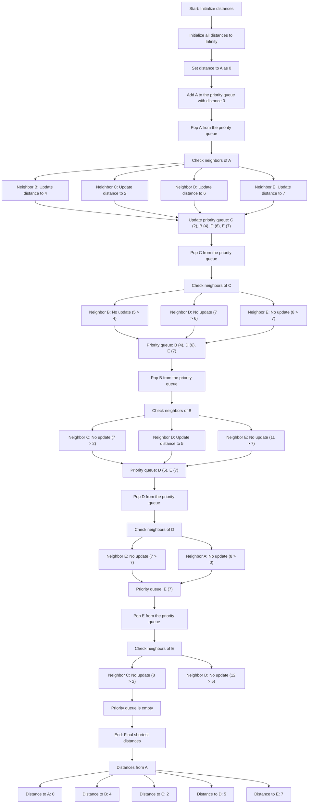

</details>

---

There is an example of the algorithm in action:

<div align="center">
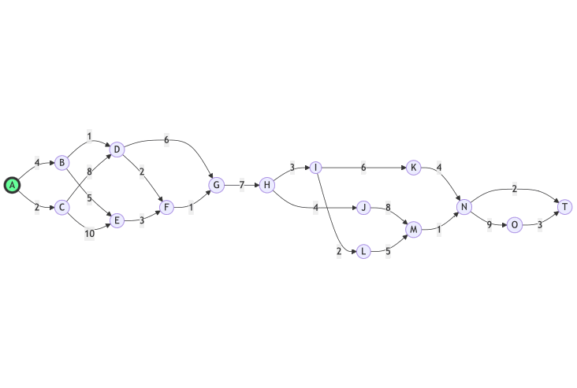
<p>Final Path of weight 28: <span style="color:lime">A -> B -> D -> F -> G -> H -> I -> L -> M -> N -> T</span></p>
</div>

|Vertices|Shortest Path From A|Visited|
|:-:|:-:|:-:|
|<span style="color:lime">A</span>|<span style="color:lime">0</span>|True|
|<span style="color:lime">B</span>|<span style="color:lime">4 = 0 + 4</span>|True|
|<span style="color:red">C</span>|2|True|
|<span style="color:lime">D</span>|<span style="color:lime">5 = 4 + 1</span>|True|
|<span style="color:red">E</span>|6|False|
|<span style="color:lime">F</span>|<span style="color:lime">7 = 5 + 2</span>|True|
|<span style="color:lime">G</span>|<span style="color:lime">8 = 7 + 1</span>|True|
|<span style="color:lime">H</span>|<span style="color:lime">15 = 8 + 7</span>|True|
|<span style="color:lime">I</span>|<span style="color:lime">18 = 15 + 3</span>|True|
|<span style="color:red">J</span>|19|True|
|<span style="color:red">K</span>|24|False|
|<span style="color:lime">L</span>|<span style="color:lime">20 = 18 + 2</span>|True|
|<span style="color:lime">M</span>|<span style="color:lime">25 = 20 + 5</span>|True|
|<span style="color:lime">N</span>|<span style="color:lime">26 = 25 + 1</span>|True|
|<span style="color:red">O</span>|35|False|
|<span style="color:lime">T</span>|<span style="color:lime">28 = 26 + 2</span>|True|

### 11.2. Pseudocode

#### 11.2.1. Node Structure

The nodes will be created as a structure with the following attributes:

- **landmark1:** The starting node.
- **landmark2:** The ending node.
- **weight:** The time taken to travel between the nodes.

```cpp
typedef struct Edge {   // Define the current Edge
    int landmark2;    // Define the connection to the next node
    int weight;         // Define the weight of the edge
} s_Node;
```

>[!CAUTION]
> This current structure can be modified to fit the needs of the Adjacency List or the Graph Structure.

#### 11.2.2. Adjacency List / Graph Structure

The adjacency list will be created as an array of nodes with the following attributes:

>[!WARNING]
> The following space propose multiple way to create the project basis, each have their own advantages and disadvantages. I let multiple ways to do it in order to give ideas to the team. Also each proposition have their own BigO[^16] notation.

- **size:** The number of nodes in the graph.
- **list:** The array of nodes representing the adjacency list.

```cpp
typedef struct AdjacencyList {
    int size;       // Number of nodes in the graph
    s_Node *list;   // Array of nodes representing the adjacency list
} s_AdjacencyList;
```

>[!IMPORTANT]
> Time complexity:
>
> - **Insertion:** O(1) for each edge
> - **Lookup:** O(V) for finding an edge where V is the number of vertices
> - **Space complexity:** O(V + E) where V is the number of vertices and E is the number of edges
>
> Memory management:
>
> - Requires manual memory management to free the memory allocated for the nodes and the adjacency list
>
---
<div align="center">
<strong>OR with</strong>

</div>

```cpp
vector<vector<pair<int, int> > > adj; // Adjacency list for vector of vector of pair of int, int
```

>[!IMPORTANT]
> Time complexity:
>
> - **Insertion:** O(1) for each edge due to dynamic resizing of the vector
> - **Lookup:** O(V) for finding an edge where V is the number of vertices
> - **Space complexity:** O(V + E) where V is the number of vertices and E is the number of edges
>
> Memory management:
>
> - Automatic memory management by the vector class
> - More flexible and easier to use than manual memory management
> - Can be slower due to dynamic resizing of the vector
>
---
<div align="center">
<strong>OR with</strong>
</div>

```cpp
unordered_map<int, vector<pair<int, int>>> graph; // Adjacency list for unordered_map of int, unordered_map of int, int
```

>[!IMPORTANT]
> Time complexity:
>
> - **Insertion:** O(1) for each edge
> - **Lookup:** O(1) for finding an edge
> - **Space complexity:** O(V + E) where V is the number of vertices and E is the number of edges
>
> Memory management:
>
> - Automatic memory management by the unordered_map class
> - Faster than vector due to constant time lookup
> - Requires more memory than vector due to hash table overhead

---

>[!CAUTION]
> Since we got the structure Edge defined as a pair of int, int we can use something like:
>
>```cpp
> unordered_map<int, vector<Edge>> graph; 
>```
>
---
>[!NOTE]
> This specific methods can also be used to create hash table then the BigO[^16] notation will be O(1) for each edge and O(V) for finding an edge where V is the number of vertices.
---

## 12. REST API

### 12.1. Overview

The REST API[^3] will respond to the user request with the shortest path and the total time taken to travel between the nodes. It will also give two file formats to the user, JSON[^4] and XML[^5]. The response have to be less than one second.

### 12.2. Dependencies

- CMake[^12]
- Asio[^13]
- Boost[^14]
- Crow[^15]

### 12.3. Installation

#### 12.3.1. Windows

#### 12.3.2. macOs

1. You will have to install [Homebrew](https://brew.sh) to install the dependencies.  
2. You will have to install the following dependencies:

    ```bash
    brew install cmake asio boost   #Install cmake, asio and boost
    ```

3. Download the `crow_all.h` file from the Crow repository by clicking [here](https://github.com/CrowCpp/crow/releases/tag/v1.2.0).
4. Place the `crow_all.h` at the same root from your `main.cpp` of your api.
5. Create a file `CMakeLists.txt` at the same root from your `main.cpp` of your api that will contains the following:

    ```cmake
    cmake_minimum_required(VERSION 3.10)
    project(CrowExample)

    set(CMAKE_CXX_STANDARD 14)

    find_package(Boost REQUIRED)

    include_directories(${Boost_INCLUDE_DIRS} ./include)

    set(CMAKE_RUNTIME_OUTPUT_DIRECTORY ${CMAKE_BINARY_DIR}/build)

    add_executable(CrowExample main.cpp)  # Replace `main.cpp` by the name of your main file

    ```

6. Create a file `main.cpp` at the same root from your `CMakeLists.txt` that will contains the following:

    ```cpp
    #include "crow_all.h"
        int main() {
        // Create an instance of the Crow application
        crow::SimpleApp app;

        // Example of a GET request with the route /api/user
        CROW_ROUTE(app, "/api/user").methods(crow::HTTPMethod::GET)
        ([]() {
            crow::json::wvalue response;
            response["name"] = "John Doe";
            response["age"] = 30;
            response["status"] = "success";
            return response;
        });

        // Run the server
        std::cout << "Server running on http://localhost:8080\n";
        app.port(8080).multithreaded().run();   
        return 0;
    }
    ```

7. Run the following command to build the project:

    ```bash
    cmake .; make       #From the root folder   (execute the CMakeLists.txt)
    cmake ..; make      #From the build folder  (execute the CMakeLists.txt)
    ```

8. Run the following command to run the project:

    ```bash
    ./CrowExample      #From the build folder   
    ```

#### 12.3.3. Linux

### 12.4. Template

The library `crow` have a template system that can be used to respond to the user request depending on the status code. This file is located in the api folder and have to be named exactly `templates` and contains `.html` files. To use this templates you have to use the `crow::mustache::load` function like [here](https://crowcpp.org/master/guides/templating/).

```bash
├── src # folder where all the code will be implemented
│  ├── api # folder where all the api code will be stored
│  │  └── static # folder where all the pages will be stored                           
│  │    └── index.html # file that will be used when the home page is requested
│  ├── build # folder where all the build files will be stored
etc...  

```

```cpp
// Code example:
CROW_ROUTE(app, "/").methods(crow::HTTPMethod::GET)
([]() {
    auto page = crow::mustache::load("404.html");
    return page.render();
});

```

### 12.5. Accessibility

There is the global view of how the next part will be implemented.

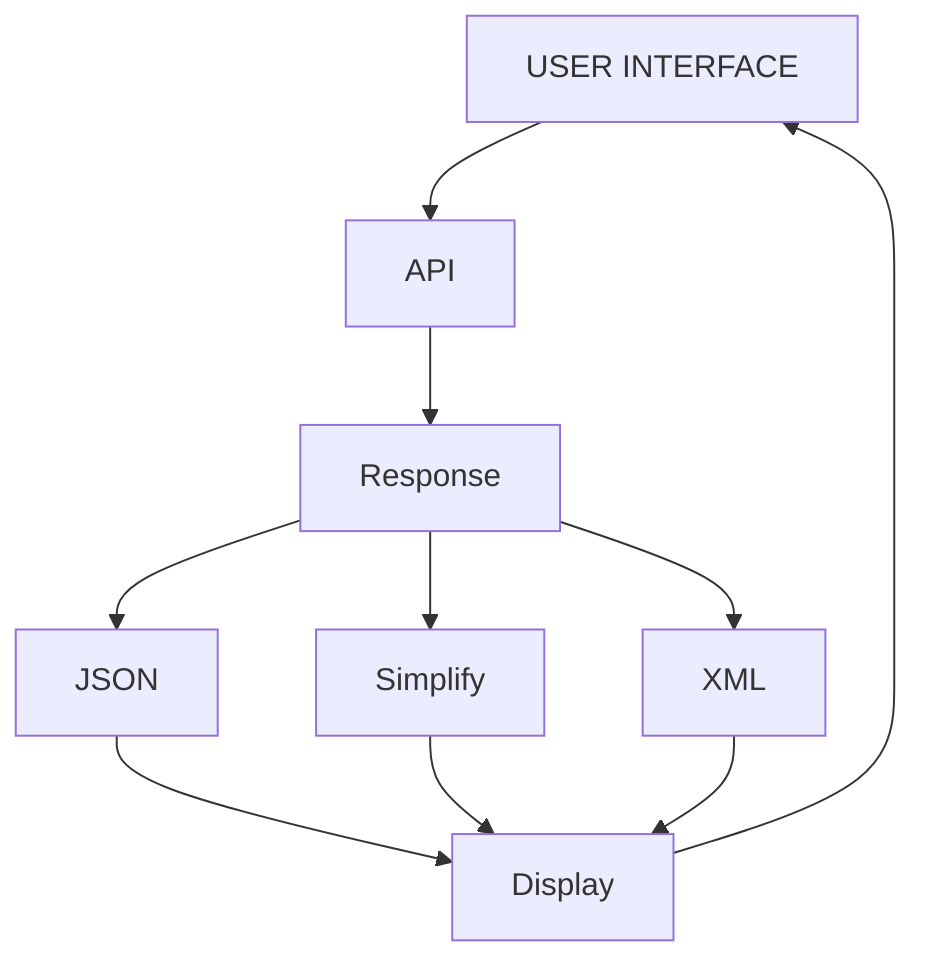

#### 12.5.1. HTML (prototype)

The following HTML code can be used to test the API[^3] using a web browser:

[Click here to see the HTML file.](../images/technical/index.md)

#### 12.5.2. Command Line

The following commands can be used to test the API[^3] using the command line:

```bash
# Simplified Response
curl "http://localhost:8080/api/shortest-path/?landmark_1=1&landmark_2=1000"
```

```bash
# JSON[^4] Response
curl "http://localhost:8080/api/shortest-path/json?landmark_1=1&landmark_2=1000"
```

```bash
# XML[^5] Response
curl "http://localhost:8080/api/shortest-path/xml?landmark_1=1&landmark_2=1000"
```

#### 12.5.3. Application

This following part will shows how the api have to respond to the user request depending the status of the request.

```cpp
int landmark_1;
int landmark_2;
cout << string("Select the nodes you want to find the shortest path between:\n");
cout << string("Node 1: ");
cin >> landmark_1;      // User input if not int have to be handle
cout << string("Node 2: ");
cin >> landmark_2;      // User input if not int have to be handle

// Confirmation of the request
cout << string("You want to find the shortest path between node ") << landmark_1 << string(" and node ") << landmark_2 << string("Y/N: ");
do {
    string confirmation;
    cin >> confirmation;
    if (confirmation == "Y" || confirmation == "y") {
        short format;
        cout << string("Select the format of the response:\n");
        cout << string("1. JSON[^4]\n");
        cout << string("2. XML[^5]\n");
        cout << string("3. Simplify\n");
        cout << string("0. Cancel\n");
        cin >> format;
        do {
            switch (format) {
                case 1:
                    // Send the request to the API
                    string url = "http://localhost:8080/api/shortest-path/json?landmark_1=" + to_string(landmark_1) + "&landmark_2=" + to_string(landmark_2);
                    cout << string("Request sent to the API: ") << url << endl;
                    // Wait for the response
                    // Display the response
                    break;
                case 2:
                    // Send the request to the API
                    string url = "http://localhost:8080/api/shortest-path/xml?landmark_1=" + to_string(landmark_1) + "&landmark_2=" + to_string(landmark_2);
                    cout << string("Request sent to the API: ") << url << endl;
                    // Wait for the response
                    // Display the response
                    break;
                case 3:
                    // Send the request to the API
                    string url = "http://localhost:8080/api/shortest-path?landmark_1=" + to_string(landmark_1) + "&landmark_2=" + to_string(landmark_2);
                    cout << string("Request sent to the API: ") << url << endl;
                    // Wait for the response
                    // Display the response
                    break;
                case 0:
                    cout << string("Request canceled.") << endl;
                    break;
                default:
                    cout << string("Please enter a valid format: ");
                    cin >> format;
                    break;
            }
        } while (format != 0 && format != 1 && format != 2 && format != 3);
       
    } else if (confirmation == "N" || confirmation == "n") {
        cout << string("Request canceled.") << endl;
        break;
    }
    else {
        cout << string("Please enter a valid answer (Y/N): ");
    }

} while (confirmation != "Y" && confirmation != "y" && confirmation != "N" && confirmation != "n");


```

### 12.6. API Endpoints & Response

Since the API[^3] will be using only the GET[^6] methods, for a unique endpoint GET[^6], the following endpoints will be used:

- **GET `/api/shortest-path?:landmark_1&:landmark_2`** Returns the shortest path and total time between two nodes in JSON[^4] format like this:

    ```json
    {
        "path": [1, 250, 200, 1000],
        "time": 65429
    }
    ```

>[!NOTE]
> When request will be complete the URL should look like this: `http://localhost:8080/api/shortest-path?landmark_1=1&:landmark_2=1000`

- **GET `/api/shortest-path?:landmark_1&landmark_2/json`** Returns the paths and time between each nodes in JSON[^4] format.

    ```json
    {
        "path": [
            {
                "landmark_1": 1,
                "landmark_2": 250,
                "time": 200
            },
            {
                "landmark_1": 250,
                "landmark_2": 200,
                "time": 1000
            },
            {
                "landmark_1": 200,
                "landmark_2": 1000,
                "time": 64229
            }
        ]
    }
    ```

- **GET `/api/shortest-path?:landmark_1&landmark_2/xml`** Returns the paths and time between each nodes in XML[^5] format.

    ```xml
    <?xml version="1.0" encoding="UTF-8"?>
    <paths>
        <path>
            <landmark_1>1</landmark_1>
            <landmark_2>250</landmark_2>
            <time>200</time>
        </path>
        <path>
            <landmark_1>250</landmark_1>
            <landmark_2>200</landmark_2>
            <time>1000</time>
        </path>
        <path>
            <landmark_1>200</landmark_1>
            <landmark_2>1000</landmark_2>
            <time>64229</time>
        </path>
    </paths>

    ```

>[!CAUTION]
> The previous endpoints for the `JSON`[^4] and `XML`[^5] format will not provide file download option. The user will have to copy the response and save it in a file.

>[!IMPORTANT]
> This can be modified and needed later.

## 13. Memory Management

For this part we will see all the parts where the memory have and can  be managed.

### 13.1. Preprocessing

## 14. Deployment

### 14.1. Environment

To deploy the Quickest Path project, ensure the following environment setup:

1. **Operating System:** The project can be deployed on Windows, macOS, or Linux.
2. **Dependencies:** Ensure all dependencies are installed:
    - CMake[^12]
    - Asio[^13]
    - Boost[^14]
    - Crow[^15]
3. **Compiler:** A C++[^2]17 compatible compiler (e.g., GCC[^17] ...).

### 14.2. Steps

1. **Clone the Repository:**

    ```bash
    git clone https://github.com/algosup/2024-2025-project-3-quickest-path-team-2.git
    cd 2024-2025-project-3-quickest-path-team-2/src/
    ```

2. **Build the Project:**

    ```bash
    mkdir build
    cd build
    cmake ..
    make    # Where the Makefile is located
    ```

3. **Run the Application:**

    ```bash
    ./QuickestPath
    ```

## 15. Maintenance

### 15.1. Updates

- **Regular Updates:** Ensure the project dependencies are regularly updated to their latest versions.
- **Bug Fixes:** Monitor and fix any reported bugs promptly.
- **Feature Enhancements:** Periodically review and implement new features or improvements based on user feedback.
- **Documentation:** Keep the project documentation up-to-date with any changes or new features.

## 16. Glossary

[^1]: Comma-Separated Values: A file format used to store tabular data.

[^2]: C++ Programming Language: A general-purpose programming language.

[^3]: Representational State Transfer Application Programming Interface: A set of rules for creating web services.

[^4]: JavaScript Object Notation: A lightweight data interchange format.

[^5]: Extensible Markup Language: A markup language that defines a set of rules for encoding documents.

[^6]: Hypertext Transfer Protocol GET Method: A request method used to request data from a server.

[^7]: C++17 Standard: A version of the C++ programming language standard.

[^8]: Directed Acyclic Graph: A graph with directed edges and no cycles.

[^9]: Depth First Search: An algorithm for traversing or searching tree or graph data structures.

[^10]: Breadth First Search: An algorithm for traversing or searching tree or graph data structures.

[^11]: Dijkstra's Algorithm: An algorithm for finding the shortest paths between nodes in a graph.

[^12]: Cross-Platform Make: A build automation tool.

[^13]: Asynchronous Input/Output: A form of input/output processing that permits other processing to continue before the transmission has finished.

[^14]: Boost C++ Libraries: A set of libraries for the C++ programming language.

[^15]: Crow C++ Microframework: A C++ microframework for web development.

[^16]: Big O Notation: A mathematical notation that describes the limiting behavior of a function.

[^17]: GNU Compiler Collection: A compiler system produced by the GNU Project.
