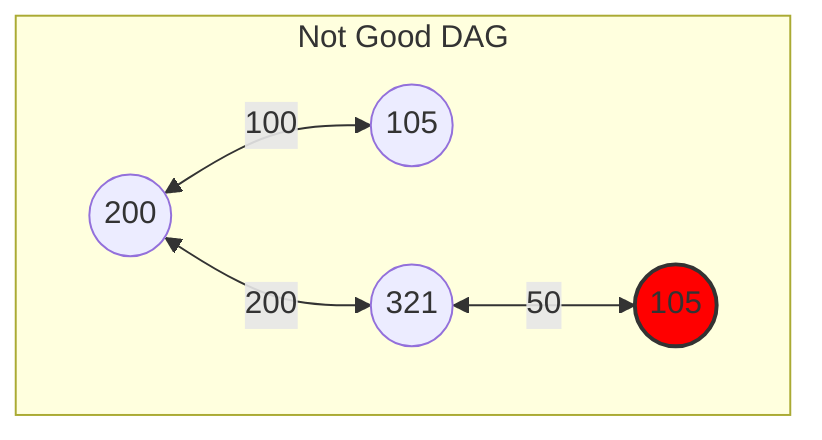
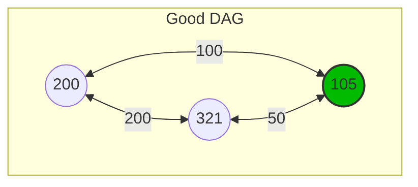
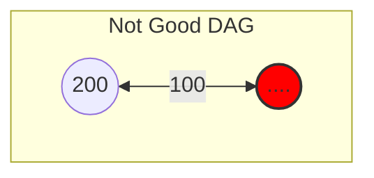
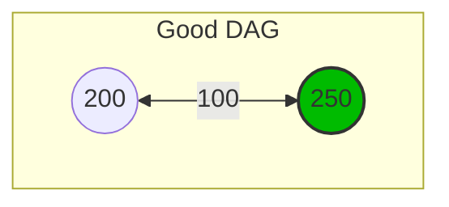
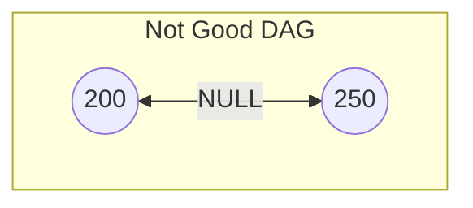
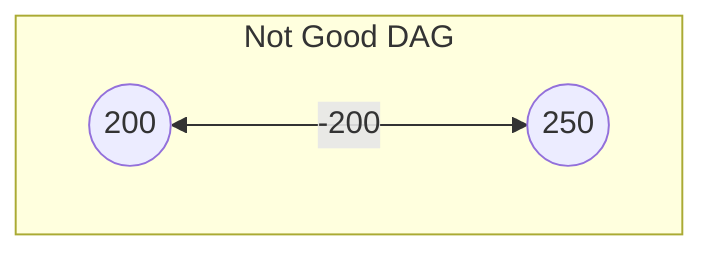
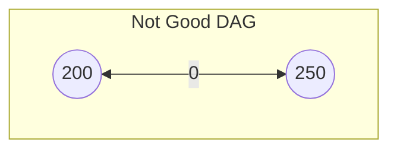
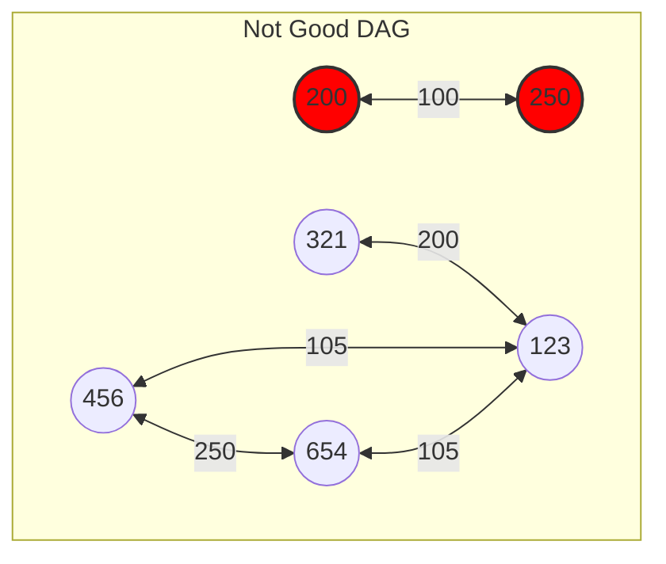
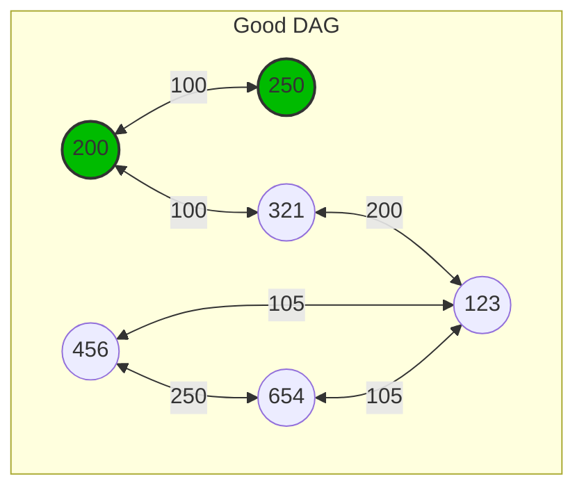

# Technical Specification Document

## Project Overview
<div style="text-align: center">

**Project Name:** Quickest Path  
**Team:** Team 2  
**Document Edited by:** [Guillaume DESPAUX](https://github.com/guillaumedespaux)    
**Last Time Modified:** 01/08/2025

</div>

## Table of Contents
<details>
<summary> <u>Deploy the list</u> </summary>

1. [Introduction](#introduction)
2. [Objectives](#objectives)
3. [Requirements](#requirements)
4. [System Architecture](#system-architecture)
5. [Data Handling](#data-handling)
6. [Algorithm](#algorithm)
7. [User Interface](#user-interface)
8. [Testing](#testing)
9. [Deployment](#deployment)
10. [Maintenance](#maintenance)
</details>

## Introduction
The Quickest Path project aims to develop a software solution that calculates the fastest path between two nodes based on data provided in a CSV[^1] file using C++[^2], the program have to use an REST API[^3] and response in Json[^4] and XML[^5] formats.

## Objectives
- Develop an efficient algorithm to find the quickest path.
- Ensure the software can handle large datasets.
- Analyze the data given to ensure a proper integrity of data.
- Provide a user-friendly interface for input and output.
- Provide answer through an API using the GET[^6] methods.

## Project Folder Structure

```bash
2024-2025-project-3-quickest-path-team-2
├── .gitignore  # ignore the file mentioned inside
├── bin # store all executable programs
├── documents   # folder that store all the main files
│  ├── functional                               
│  ├── images   # reserved for all images contained in files
│  │  ├── functional                             
│  │  ├── management                            
│  │  ├── quality_Assurance                     
│  │  └── technical                             
│  ├── management                               
│  ├── quality_Assurance                        
│  ├── technical                                
│  │  └── technical_specification.md            
│  └── user_Manual                              
├── README.md   # a resume of what the project stand for and how to use it
├── src # folder where all the code will be implemented
│  ├── build # folder where all the build files will be stored
│  ├── data # folder where .csv file will be stored
│  │  └── example.csv                           
│  ├── includes # folder where .hpp file will be stored
│  │  └── software.hpp                             
│  ├── software.cpp                             
└── test    # reserved for the test unit part
  └── test.cpp                                  
``` 

## Conventions
There are the conventions to follow during the project.

### Naming Conventions

|   Type    |   Example     |   Convention name |
|:-         |:-             |:-                 |
|Folder     |folder_Name    |camel_Snake_Case   |
|File       |file_name      |snake_case         |
|DEFINE     |DEFINE_WELL    |CONSTANT_CASE      |
|typedef    |TPDF_STRING    |CONSTANT_CASE      |
|const      |BestConstEver  |PascalCase         |
|variable   |bestVarEver    |camelCase          |
|function   |good_function()|snake_case         |
|struct     |s_Struct       |camel_Snake_Case   |
|class      |class_Class    |camel_Snake_Case   |


> [!WARNING]  
> The types **DEFINE** and **typedef** uses the same convention, however typedef have for the first word an abbreviation then we indicate the type used.

>[!CAUTION]
> Each structure have to have in their name the pre-fix "s_".

### Files Conventions
>[!NOTE]
> Each .cpp file have to be joined with it's equivalent named .hpp, for instance if the file software.cpp is created the file software.hpp **HAVE** to be created.

There is an example to use the different files.


```cpp
software.cpp
    #include "software.hpp"
    #define NICE_TEXT "Hello,"

    int main(void) {
        // Using Class
        Student class_Guillaume("Guillaume", 21);
        class_Guillaume.print_some_text(NICE_TEXT);
        class_Guillaume.declare_the_function(42);
        class_Guillaume.~Student();

        // Using Struct
        s_Student *struct_Guillaume = new s_Student;
        struct_Guillaume->name = "Guillaume";
        struct_Guillaume->age = 21;
        declare_the_function(struct_Guillaume->age);
        delete struct_Guillaume;
    }

    Student::Student(string name, unsigned short age) {
        this->name = name;
        this->age = age;
    }

    Student::~Student() {
        cout << "The student " << this->name << " is deleted." << endl;
    }

    int declare_the_function(int bestIntEver) {
        int newBestIntEver = bestIntEver;
        newBestIntEver += bestIntEver;
        return newBestIntEver;
    }

    void print_some_text(string NICE_TEXT) {
        if (NICE_TEXT != "\0") {
            cout << NICE_TEXT << " world!" << endl;
        }
        cout << "NICE_TEXT is empty." << endl;
    }
```
>[!IMPORTANT]
>The .cpp file is only used to implement the logical interaction in.
> 
```cpp
software.hpp
    #pragma once
    #include <iostream>
    #include <string>
    
    using namespace std;

    typedef struct Student{
        string name;
        unsigned short age;
    } s_Student;

    class Student {
        private:
            string name;
            unsigned short age;
        public:
            int declare_the_function(int bestIntEver);
            void print_some_text(string niceText);
            Student(string name, unsigned short age);
            ~Student();
    };

    /*
        This function double the value of itself.
        params:
            int bestIntEver
        return: 
            int newBestIntEver
    */
    int declare_the_function(int bestIntEver);
    
    /*
        Permit the print the text given as parameter.
        params:
            string niceText;
    */
    void print_some_text(string niceText);
```
>[!CAUTION]
>The .hpp file permit only to declare functions and comment the utility of each ones, explaining also the parameters and what it return.

> [!NOTE]
> ```cpp
> #pragma once
> ```
> Is a preprocessor directive used to prevent header files from being included multiple times.

## Requirements
Before continuing reading, it is highest recommended to read the [functional specification](../functional/) document.

## System Architecture
### Overview
- **Input:** CSV file containing node connections and times.
- **Processing:** Algorithm to calculate the quickest path.
- **Output:** Display of the quickest path and time.

### Components
1. **Data Importer:** Reads and parses the CSV file.
2. **Path Calculator:** Implements the algorithm to find the quickest path.
3. **User Interface:** Allows users to input nodes and view results.

### Technologies
We will use the following technologies:
1. C++
   - C++17
   - Standard libraries
2. REST API
    - Libraries
    - GET method
3. CSV
   - .csv file format
4. JSON
   - .json file format
5. XML
   - .xml file format

## Data Handling
### CSV File Format
- **Columns:** landmark_1, landmark_2, Time
- **Example:**
    ```
    landmark_1,landmark_2,Time
    1,2,1000
    2,3,1500
    ```

### Data Validation
When CSV provided we have to make different checks to ensure the data are correct and usable and follows the connectivity check rules. We also have to check if the data provided is a Directed Acyclic Graph (DAG) to ensure the algorithm will work properly.

##### Loops
```csv
loop =  landmark_1, landmark_2, time
        105, 501, 200 -> First time declared
        321, 123, 200
        501, 105, 250 -> Second time declared
```
<div style="text-align: center">



</div>

##### Landmark Missing
```csv
landmark missing =  landmark_1, landmark_2, time
            , 501, 200  -> landmark_1 is missing
            321, , 200  -> landmark_2 is missing
```
<div style="text-align: center">




</div>

##### Time Missing
```csv
time missing = landmark_1, landmark_2, time
            501, 105,   -> time is missing
```
<div style="text-align: center">


</div>

##### Negative Time
```csv
time negative = landmark_1, landmark_2, time
                501, 105, -200 -> time can not be negative
```
<div style="text-align: center">


</div>

##### Time Equal to 0
```csv
time equal 0 = landmark_1, landmark_2, time
                501, 105, 0 -> time can not be equal to 0 
```
<div style="text-align: center">


</div>

##### Graph disconnected
```csv
disconnected =  landmark_1, landmark_2, time
                200 ,250, 100 -> Those two nodes are not connected
                321, 123, 200 
                456, 654, 250
                456, 321, 105
                654, 123, 105
```
<div style="text-align: center">




</div>

### Organization
To check if the data provided is a DAG we have to use the following steps:

1. Check if csv is available.
2. Check if the csv is not empty.
3. Verify if landmark_1 and landmark_2 are not the same.
4. Verify if the time is not negative or equal to 0.
5. Verify if the line's data is already in the Adjacency Matrix.
6. Start over step 3 until the end of the csv.

## Shortest Path Algorithm
This part will define the algorithm used to find the quickest path between two nodes and how it should be implemented.

### Description
The algorithm we will use is named **Dijkstra**, it permit the find the shortest path between two vertices taking in account the weight of the edges between the vertices of the graph.

The algorithm is based on the following steps:
1. Create a set of all vertices with the shortest distance from the source node.
2. Initialize the distance of the source node to 0 and all other vertices to infinity.
3. Set the source node as the current node.
4. For each neighbor of the current node, calculate the distance from the source node.
5. If the calculated distance is less than the current distance, update the distance.
6. Mark the current node as visited and remove it from the set.
7. If the destination node is reached or the set is empty, stop the algorithm.
8. Repeat steps 3-7 until the destination node is reached.

<div style="text-align: center">

<p>Final Path of weight 28: <span style="color:lime">A -> B -> D -> F -> G -> H -> I -> L -> M -> N -> T</span></p>
</div>

|Vertices|Shortest Path From A|Visited|
|:-:|:-:|:-:|
|<span style="color:lime">A</span>|<span style="color:lime">0</span>|True|
|<span style="color:lime">B</span>|<span style="color:lime">4</span>|True|
|<span style="color:red">C</span>|2|True|
|<span style="color:lime">D</span>|<span style="color:lime">5</span>|True|
|<span style="color:red">E</span>|6|False|
|<span style="color:lime">F</span>|<span style="color:lime">2</span>|True|
|<span style="color:lime">G</span>|<span style="color:lime">8</span>|True|
|<span style="color:lime">H</span>|<span style="color:lime">15</span>|True|
|<span style="color:lime">I</span>|<span style="color:lime">18</span>|True|
|<span style="color:red">J</span>|19|True|
|<span style="color:red">K</span>|24|False|
|<span style="color:lime">L</span>|<span style="color:lime">20</span>|True|
|<span style="color:lime">M</span>|<span style="color:lime">25</span>|True|
|<span style="color:lime">N</span>|<span style="color:lime">26</span>|True|
|<span style="color:red">O</span>|35|False|
|<span style="color:lime">T</span>|<span style="color:lime">28</span>|True|

### Pseudocode
#### Node Structure
The nodes will be created as a structure with the following attributes:
- **landmark1:** The starting node.
- **landmark2:** The ending node.
- **weight:** The time taken to travel between the nodes.

```cpp
typedef struct Node {
    int landmark1;
    int landmark2
    int weight;         
} s_Node;
```
>[!CAUTION]
> This current structure can be modified to fit the needs of the Adjacency List or the Graph Structure.

#### Adjacency List / Graph Structure
The adjacency list will be created as an array of nodes with the following attributes:
- **size:** The number of nodes in the graph.
- **list:** The array of nodes representing the adjacency list.

```cpp
typedef struct AdjacencyList {
    int size;       // Number of nodes in the graph
    s_Node *list;   // Array of nodes representing the adjacency list
} s_AdjacencyList;
```
>[!IMPORTANT]
> Time complexity:
> - **Insertion:** O(1) for each edge
> - **Lookup:** O(V) for finding an edge where V is the number of vertices
> - **Space complexity:** O(V + E) where V is the number of vertices and E is the number of edges
> 
> Memory management:
> - Requires manual memory management to free the memory allocated for the nodes and the adjacency list
---
<div style="text-align: center">
<strong>OR with</strong>

</div>

```cpp
vector< <pair<int, int> > adj[N]; // Adjacency list for vector of pair of int, int with N nodes
```
>[!IMPORTANT]
> Time complexity:
> - **Insertion:** O(1) for each edge due to dynamic resizing of the vector
> - **Lookup:** O(V) for finding an edge where V is the number of vertices
> - **Space complexity:** O(V + E) where V is the number of vertices and E is the number of edges
> 
> Memory management:
> - Automatic memory management by the vector class
> - More flexible and easier to use than manual memory management
> - Can be slower due to dynamic resizing of the vector
---
<div style="text-align: center">
<strong>OR with</strong>
</div>

```cpp
unordered_map<int, unordered_map<int, int> > adj; // Adjacency list for unordered_map of int, unordered_map of int, int
```
>[!IMPORTANT]
> Time complexity:
> - **Insertion:** O(1) for each edge
> - **Lookup:** O(1) for finding an edge
> - **Space complexity:** O(V + E) where V is the number of vertices and E is the number of edges
>
> Memory management:
> - Automatic memory management by the unordered_map class
> - Faster than vector due to constant time lookup
> - Requires more memory than vector due to hash table overhead
---

## REST API
### Overview
The REST API will respond to the user request with the shortest path and the total time taken to travel between the nodes. It will also give two file formats to the user, JSON and XML. The response have to be less than one second. 

### Dependencies
- CMake[^x]
- Asio[^x]
- Boost[^x]
- Crow[^x]

### Installation
#### Windows
#### macOs
1. You will have to install [Homebrew]("https://brew.sh") to install the dependencies.  
2. You will have to install the following dependencies:
```bash
brew install cmake asio boost   #Install cmake, asio and boost
```
3. Download the `crow_all.h` file from the [Crow]("https://github.com/CrowCpp/Crow/releases/tag/v1.2.0") repository.
4. Place the `crow_all.h` at the same root from your `main.cpp` of your api.
5. Create a file `CMakeLists.txt` at the same root from your `main.cpp` of your api that will contains the following:
```cmake
cmake_minimum_required(VERSION 3.10)
project(CrowExample)

set(CMAKE_CXX_STANDARD 14)

find_package(Boost REQUIRED)

include_directories(${Boost_INCLUDE_DIRS} ./include)

set(CMAKE_RUNTIME_OUTPUT_DIRECTORY ${CMAKE_BINARY_DIR}/build)

add_executable(CrowExample main.cpp)  # Replace `main.cpp` by the name of your main file

```
6. Create a file `main.cpp` at the same root from your `CMakeLists.txt` that will contains the following:
```cpp
#include "crow_all.h"
    int main() {
    // Create an instance of the Crow application
    crow::SimpleApp app;

    // Example of a GET request with the route /api/user
    CROW_ROUTE(app, "/api/user").methods(crow::HTTPMethod::GET)
    ([]() {
        crow::json::wvalue response;
        response["name"] = "John Doe";
        response["age"] = 30;
        response["status"] = "success";
        return response;
    });

    // Run the server
    std::cout << "Server running on http://localhost:8080\n";
    app.port(8080).multithreaded().run();   
    return 0;
}
```
7. Run the following command to build the project:
```bash
cmake .; make       #From the root folder   (execute the CMakeLists.txt)
cmake ..; make      #From the build folder  (execute the CMakeLists.txt)
```
8. Run the following command to run the project:
```bash
./CrowExample      #From the build folder   
```

#### Linux

### API Endpoints
Since the API will be using only the GET methods, for a unique endpoint, the following endpoint will be used:
- **GET `/api/shortest-path?:landmark_1&:landmark_2`** Returns the shortest path and total time between two nodes in JSON format.

>[!NOTE]
> When request will be complete the URL should look like this: `http://localhost:8080/api/shortest-path?landmark_1=1&landmark_2=1000`


## User Interface
### Input
- Text fields for entering the start and end nodes.
- Button to trigger the calculation.

### Output
- Display the quickest path and total time.
- Option to view the path details.

## Testing
### Unit Tests
- Test data import functionality.
- Test path calculation with various datasets.

### Integration Tests
- Ensure all components work together seamlessly.

### Performance Tests
- Measure the time taken to process large datasets.

## Deployment
### Environment
- Specify the required software and hardware.

### Installation
- Provide steps to install and configure the software.

## Maintenance
### Updates
- Outline the process for updating the software.

### Support
- Provide contact information for technical support.

## Indexes
[^1]:
[^2]:
[^3]:
[^4]:
[^5]:
[^6]:
[^7]:
[^8]:
[^9]:
[^10]:
[^11]:
[^12]:
[^13]:
[^14]:
[^15]:
[^16]:
[^17]:
[^18]:
[^19]:
[^20]:
